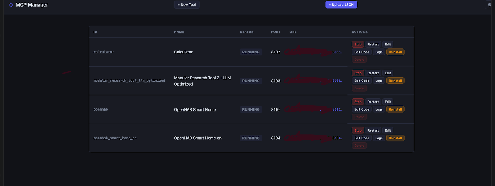

# MCP Framework — v0.0.5

A local-first manager for running OpenWebUI-compatible tool JSONs as [Model Context Protocol](https://modelcontextprotocol.io) servers.

Upload a tool export, install dependencies, start an MCP server, and expose it via Streamable HTTP for OpenWebUI, Claude Code, Codex, or any MCP client. A maintained OpenHAB integration is included to expose your smart home as a local MCP server: [openhab-ai-integration](https://github.com/torfeu/openhab-ai-integration).



---

## Quickstart

```bash
# Python 3.10+ required
python3 -m venv .venv
.venv/bin/pip install fastapi "uvicorn[standard]" pydantic python-multipart mcp packaging starlette httpx

# Start (localhost only, no auth needed)
.venv/bin/python app/manager.py

# Open the web UI
open http://127.0.0.1:7860
```

---

## Network access (e.g. for OpenWebUI on another machine)

```bash
# Always set a password before binding to a network interface
export MCP_MANAGER_PASSWORD=changeme
.venv/bin/python app/manager.py --host 0.0.0.0
```

MCP endpoints are then reachable at `http://<your-ip>:<port>/mcp`.

> **Security note:** Never bind to `0.0.0.0` without setting `MCP_MANAGER_PASSWORD`.
> The manager warns at startup if you do.

---

## Settings page

The web UI includes a **⚙ Settings** page (top-right button) for managing common runtime options:

- **Password** — set or change the manager password (requires current password if one is already set); persisted as SHA-256 hash in `runtime/settings.json`
- **Edit mode** — switch between full / upload-only / readonly at runtime
- **MCP Bearer Token** — set, reveal (👁), generate (⟳), or remove the token that protects all MCP endpoints; stored in `runtime/settings.json`
- **Restart Manager** — restart the manager process from the UI

All settings survive restarts. CLI flags always take precedence over saved settings.

---

## Edit modes

Three levels control what the web UI allows. Use the flag that matches your trust level:

| Flag | Mode | Allowed | Blocked |
|---|---|---|---|
| *(none)* | **full** | everything | — |
| `--no-code-edit` | **upload-only** | start/stop/restart, logs, reinstall, upload JSON, config edit, delete | inline code editor (New Tool, Edit Code) |
| `--no-edit` | **readonly** | start/stop/restart, logs, reinstall | upload, code editor, config edit, delete |

Use `--no-edit` on a server where you want to prevent anyone from injecting arbitrary Python code through the web interface. `--no-code-edit` is a middle ground: operators can still install pre-built tool JSONs but cannot write or modify Python code directly.

The current mode is reported at startup:
```
MCP Manager starting on http://0.0.0.0:7860  [auth: enabled, edit: upload-only, mcp-auth: bearer-token]
```

Both flags also enforce their restrictions at the API level — the corresponding routes return `403` even if someone bypasses the UI.

Edit mode can also be changed at runtime via the Settings page and persists across restarts.

---

## MCP endpoint authentication

By default MCP endpoints are open. To require a Bearer token on all MCP endpoints:

```bash
# Set at startup (overrides saved setting)
.venv/bin/python app/manager.py --host 0.0.0.0 --mcp-token mysecrettoken123

# Lock so the token cannot be changed via the web UI
.venv/bin/python app/manager.py --host 0.0.0.0 --mcp-token mysecrettoken123 --no-token-edit
```

The token can also be set, revealed, and regenerated in the Settings page (unless `--no-token-edit` is active).

**After changing the token, restart each MCP server** — runners read the token at startup.

In OpenWebUI, set the token as Bearer token when adding the MCP connection. In Claude Code, add it to `~/.claude/mcp.json`:

```json
{
  "mcpServers": {
    "my-tool": {
      "url": "http://<your-server-ip>:8104/mcp",
      "headers": { "Authorization": "Bearer mysecrettoken123" }
    }
  }
}
```

---

## Authentication

| Variable | Description |
|---|---|
| `MCP_MANAGER_PASSWORD` | Plain-text password — hashed with SHA-256 at startup |
| `MCP_MANAGER_PASSWORD_HASH` | Pre-hashed SHA-256 hex digest (takes precedence) |
| `MCP_BEARER_TOKEN` | Bearer token for MCP endpoints when starting runner/server components directly. With `app/manager.py`, use `--mcp-token` or the Settings page. |

When auth is active:
- The web UI shows a login screen. The password is verified against a protected endpoint (`GET /api/auth-check`) — wrong passwords are rejected immediately.
- All mutating and sensitive API routes require a `Bearer` token.
- Auth is initialized at module import time, so it is also active when starting directly via `uvicorn app.admin_server:app`.

### Protected routes (require Bearer token)

| Method | Route | Description |
|---|---|---|
| `GET` | `/api/auth-check` | Token validation endpoint |
| `GET` | `/api/settings` | Manager settings (auth, edit mode, MCP token status) |
| `PUT` | `/api/settings` | Update settings |
| `GET` | `/api/settings/mcp-token` | Retrieve current MCP token value *(blocked by `--no-token-edit`)* |
| `POST` | `/api/server/restart` | Restart the manager process |
| `GET` | `/api/instances/{id}/config` | Full config including values |
| `GET` | `/api/instances/{id}/tool-code` | Python source of a tool *(blocked by `--no-code-edit`)* |
| `GET` | `/api/instances/{id}/logs/install` | Install log |
| `GET` | `/api/instances/{id}/logs/runtime` | Runtime log |
| `POST` | `/api/instances/upload` | Upload & install a new tool *(blocked by `--no-edit`)* |
| `PUT` | `/api/instances/{id}` | Edit config *(blocked by `--no-edit`)* |
| `PUT` | `/api/instances/{id}/tool-code` | Save edited tool code *(blocked by `--no-code-edit`)* |
| `POST` | `/api/instances/{id}/start` | Start |
| `POST` | `/api/instances/{id}/stop` | Stop |
| `POST` | `/api/instances/{id}/restart` | Restart |
| `POST` | `/api/instances/{id}/reinstall` | Reinstall dependencies |
| `POST` | `/api/tools/validate` | Validate tool code *(blocked by `--no-code-edit`)* |
| `POST` | `/api/tools/export` | Export tool as OpenWebUI JSON *(blocked by `--no-code-edit`)* |
| `DELETE` | `/api/instances/{id}` | Delete *(blocked by `--no-edit`)* |

### Open routes (no auth required)

| Method | Route | Description |
|---|---|---|
| `GET` | `/api/auth-status` | Returns `{"auth_enabled": bool, "edit_mode": "full"\|"upload"\|"readonly"}` |
| `GET` | `/api/instances` | Instance list (status, URLs) |
| `GET` | `/api/instances/{id}` | Single instance status and URL |
| `GET` | `/api/tools/template` | Starter template for the editor |

---

## Tool Editor

The built-in editor lets you write, validate, and export OpenWebUI-compatible tool JSONs directly in the browser:

- Python syntax highlighting (CodeMirror)
- Live validation: syntax check, runtime inspection, type-hint → JSON Schema generation
- Export as `.json` (importable into OpenWebUI)
- **Edit Code** on any existing MCP server to modify it in-place

> The editor is hidden automatically when `--no-code-edit` or `--no-edit` is active.

### Schema generation

The framework inspects the actual Python code to build accurate MCP tool schemas:

- `typing.Literal["a", "b"]` → `"enum": ["a", "b"]` in the MCP schema
- `Annotated[T, Field(description="...")]` → `"description"` per parameter
- Google-style `Args:` docstring section → `"description"` per parameter (fallback)
- Default values → `"default"` in the schema
- `Optional[Literal[...]]` is unwrapped correctly

---

## systemd (optional)

Example files are in `deploy/`. Never put secrets directly into the service file.

**1. Create the environment file**

```bash
sudo cp deploy/mcp-manager.env.example /etc/mcp-manager.env
sudo chmod 600 /etc/mcp-manager.env
sudo nano /etc/mcp-manager.env   # set MCP_MANAGER_PASSWORD and optionally MCP_BEARER_TOKEN
```

**2. Create the service file**

```bash
sudo cp deploy/mcp-manager.service.example /etc/systemd/system/mcp-manager.service
sudo nano /etc/systemd/system/mcp-manager.service
# Replace YOUR_USER and adjust WorkingDirectory / ExecStart to your actual paths
# Add --no-edit, --no-code-edit, --mcp-token, --no-token-edit to ExecStart as needed
```

**3. Enable and start**

```bash
sudo systemctl daemon-reload
sudo systemctl enable --now mcp-manager
sudo journalctl -u mcp-manager -f
```

---

## Config format

See `configs/example.json` for a full template. Configs live in `configs/` — one JSON file per MCP server.

---

## Project layout

```
app/
  manager.py            Entry point (CLI) — --host, --no-edit, --no-code-edit, --mcp-token, --no-token-edit
  admin_server.py       FastAPI admin API + web server
  mcp_runner.py         Single MCP subprocess (Streamable HTTP + optional Bearer token auth)
  auth.py               Manager auth, edit mode, MCP token helpers
  settings_store.py     Persistent settings (runtime/settings.json)
  config_store.py       Config file I/O + port management
  process_manager.py    Subprocess lifecycle (start/stop/restart)
  tool_loader.py        OpenWebUI JSON → MCP tool definitions + schema generation
  tool_editor.py        Code validation + OpenWebUI JSON export
  dependency_manager.py pip install handling
  schema.py             Pydantic models
  security.py           Package validation, secret masking
  logger.py             Logging setup
configs/                Per-server JSON configs (one file = one MCP)
tools/                  Uploaded OpenWebUI tool JSONs
web/                    Frontend (HTML + JS + CSS)
runtime/                PIDs + logs + settings.json (gitignored)
deploy/                 systemd service + env file examples
```

---

## Changelog

### v0.0.5
- **Settings page** — ⚙ button in the web UI for managing password, edit mode, MCP token and manager restart; all settings persisted in `runtime/settings.json`
- **MCP Bearer Token auth** — optional token protecting all MCP endpoints; `--mcp-token` and `--no-token-edit` CLI flags; token visible/hidden with 👁 toggle and ⟳ generator in the UI
- **Improved schema generation** — `Literal[...]` → `enum`, `Annotated[T, Field(description=...)]` and Google-style `Args:` docstrings → `description`, defaults → `default`; built from live Python code, not the pre-built specs

### v0.0.4
- Three edit modes: `--no-code-edit` (upload-only) and `--no-edit` (readonly) — enforced at API and UI level
- Edit mode reported at startup and exposed via `/api/auth-status`

### v0.0.3
- systemd deploy examples (`deploy/mcp-manager.service.example`, `deploy/mcp-manager.env.example`)
- Password via `EnvironmentFile` — no secrets in the service file

### v0.0.2
- Bearer-token authentication (SHA-256, set via `MCP_MANAGER_PASSWORD`)
- Login modal — verified against protected `/api/auth-check` endpoint
- Config, tool-code, and log routes require auth
- Auth initializes at module import time

### v0.0.1
- Initial release: OpenWebUI JSON → MCP server, web UI, auto-start, Streamable HTTP transport

---

## Credits

- [CodeMirror](https://codemirror.net) — MIT — in-browser code editor

---

## License

MIT — see [LICENSE](LICENSE).
