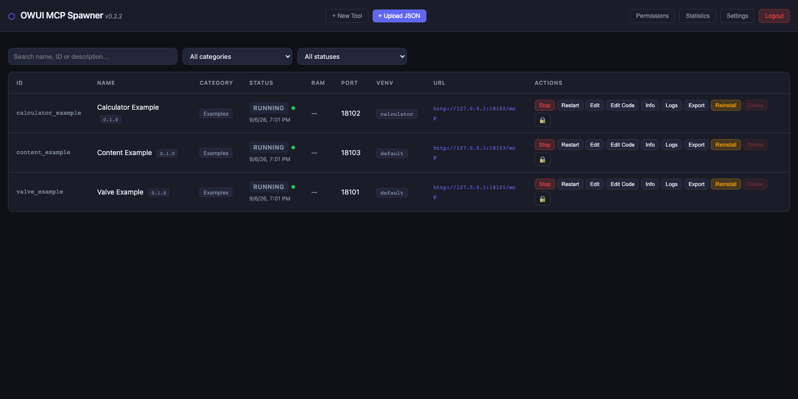
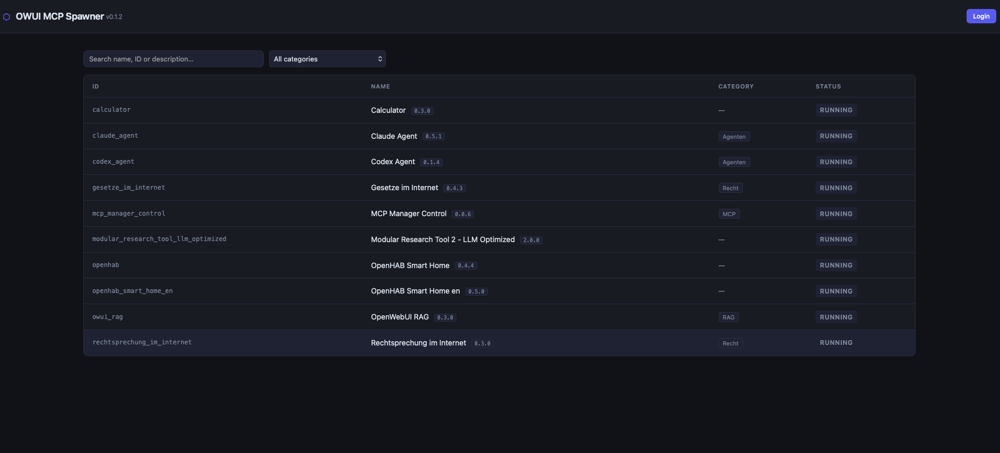

# owui-mcp-spawner

**OWUI MCP Spawner** — a local-first tool that turns OpenWebUI-compatible tool definitions into standalone [Model Context Protocol](https://modelcontextprotocol.io) servers, each spawned in its own isolated virtual environment.

Drop in a tool (an OpenWebUI JSON export or plain Python), and the spawner installs its dependencies, validates it, and brings up a dedicated MCP server reachable over Streamable HTTP — ready for OpenWebUI, Claude Code, Codex, or any MCP client. Because every instance gets its own venv, tools with conflicting dependencies never clash, and nothing pollutes the spawner process itself.

> A maintained OpenHAB integration that exposes your smart home as a local MCP server is available separately: [openhab-ai-integration](https://github.com/torfeu/openhab-ai-integration).



*The dashboard with search, category filter, per-instance venv and the lock button — every tool a running MCP server on its own port.*

---

## Quickstart

```bash
git clone https://github.com/torfeu/owui-mcp-spawner.git
cd owui-mcp-spawner

# Python 3.10+ required
python3 -m venv .venv
.venv/bin/pip install fastapi "uvicorn[standard]" pydantic python-multipart mcp packaging starlette httpx

# Start (localhost only, no auth needed)
.venv/bin/python app/manager.py

# Open the web UI
open http://127.0.0.1:7860
```

---

## Network access (e.g. for OpenWebUI on another machine)

```bash
# Always set a password before binding to a network interface
export MCP_MANAGER_PASSWORD=changeme
.venv/bin/python app/manager.py --host 0.0.0.0
```

MCP endpoints are then reachable at `http://<your-ip>:<port>/mcp`.

> **Security note:** Never bind to `0.0.0.0` without setting `MCP_MANAGER_PASSWORD`.
> The spawner warns at startup if you do.

---

## Dashboard

The instance table is the main view. Next to ID, name, status, port, venv and URL it shows:

- **Category** — a free-text grouping label (e.g. `Smart Home`, `Search`, `Utilities`) that you can set when uploading a JSON, when creating a tool in the editor, or later in **Edit → Category**. It is a spawner-side label: it lives in the MCP config, so changing it neither rewrites the tool nor restarts the instance. A tool may declare a **default** for it in its docstring header, next to `version:`:

  ```python
  """
  title: My Tool
  version: 0.1.0
  category: Smart Home
  """
  ```

  Read only at install time and only when no category was given — the shipped control tool and tool router declare `System` this way, so a fresh install sorts them out of the way without anyone setting it by hand.
- **Version** — read from the tool's `version:` docstring line (or `meta.manifest.version`). If the tool was installed from `examples/` and the spawner ships a newer copy, an orange `↑ x.y.z` marker sits next to it; the Info dialog spells out which file to copy from (see *Info view*).
- **🔑 Users & permissions** — who may run which tools, assigned from a list of the people who have actually called (see *Per-user identity*)
- **User identity** — in **Edit** a dropdown decides whether this instance cares who is calling: `off`, `optional` or `required` (see *Per-user identity*). It warns right there when no shared secret and no trusted headers are configured, because that combination fails silently later. Changing it restarts the instance, like a changed port or venv.

Above the table sits a filter bar:

- **Search** — matches ID, name, description and category as you type
- **Category dropdown** — built from the categories actually in use; `All categories` clears the filter

Both filters are client-side and combine. The spawner's own version is shown as a badge next to the title in the header.

### Info view

Every row has an **Info** button. It opens a dialog with the instance's description, category, version, venv and status — plus the **list of functions the tool actually provides**: name, description and every parameter with its type and whether it is required.

The function list is read straight from the `specs` block of the tool JSON in `tools/`, which the spawner rewrites on every code change. So it works without starting the instance and without executing any uploaded code. The dialog fetches on open, never in the polling cycle.

The dialog also shows **usage**: how often a tool of this instance has been called, when that last happened and which function it was — or *never used*, which is the more useful answer when you are deciding what to keep running.

Counted in the instance itself, not in the shared proxy: with one port per instance the manager is not in the data path at all and would see nothing. Only `tools/call` counts — a client sends `initialize` and `tools/list` on every connection regardless of use, so counting those would make every instance look equally busy.

Every call is recorded individually (time, instance, function) in `runtime/usage.db`, a SQLite database, so any period can be evaluated afterwards — including *per function*, which is what tells you that half a tool's surface is never used and only costs context. Two tables: the event log is pruned to the retention window, the totals are not, so *ever used* survives any retention setting. Deleting an instance deletes both. Time, instance and function name only — never arguments, results or caller addresses.

Written by the runners while the manager reads: WAL mode plus a busy timeout, and the write is queued rather than done inside the call — a lock held by another instance must never delay a tool call. Under load the queue is written as one transaction per burst, while an idle instance is written through immediately.

**Tools installed from `examples/` are checked against the shipped copy.** The instance table carries a compact `↑ x.y.z` marker next to the version, and the Info dialog the full `Update x.y.z` badge — the same badge the header uses for a spawner update, so *outdated* looks identical everywhere — plus the path of the file to copy from. Matched by instance id against the `id` in the shipped file, compared with `packaging.version` rather than as strings. A tool installed under a different id is not recognised.

**The badge is a button.** Clicking it asks first — spelling out that the tool's code is replaced, that the Valve values survive and that the previous version is kept — and then applies the shipped copy through the same path as a manual save: dependencies installed, code validated in the instance venv, Valves synced, instance restarted if it was running.

What makes that safe enough to offer is the snapshot: `PUT /api/instances/{id}/tool-code` writes the previous tool JSON to `runtime/history/<id>/<timestamp>.json` (last 10 kept) before anything is overwritten, so an adapted copy can be recovered. It is still an overwrite, so the question is not a formality.

The update is **forward only** — a request to "update" to a version that is not newer is refused with `409`, so a stale page cannot roll a tool back. Locked instances refuse with `403` and read-only mode hides the button entirely; in both cases the badge stays as a plain marker and says why.

Info is metadata, not source: the button stays available under `--no-code-edit` and `--no-edit`, and is hidden in guest mode.

### Usage statistics

The **📊** button in the header opens a report across all instances: calls within a chosen window (24 h / 7 / 30 / 90 days), calls in total, when each was last used, and a bar per day. Click a row to break it down **per function** — which is where it gets interesting: a tool whose ten functions include three nobody ever calls is carrying schemas through every request for nothing.

Ranked by the calls within the window, not by the lifetime total: the total favours whatever has been installed longest and answers "what was once important", not "what do I use". Instances never called are listed separately at the end — with a tool router, stopping one removes it from the catalog and frees the context its schemas occupied.

Instances in the **System** category (the control tool, a tool router) are shown apart, because they record their own traffic and would otherwise always top the ranking without being tools anyone deliberately uses.

Data comes from `GET /api/usage?days=N`, fetched when the dialog opens — never in the polling cycle. Hidden in guest mode.

> Since v0.1.3 the `specs` are always derived from the tool's own code, including for uploaded OpenWebUI JSONs — those often carry only the first line of each docstring. Existing installations are repaired once on the next start.

---

## Settings page

The web UI includes a **⚙ Settings** page (top-right button) for managing common runtime options, grouped into five tabs — **Security**, **Identity**, **System**, **Files** and **Maintenance**. All panels stay loaded, so **Save Settings** submits the whole dialog whichever tab is open; the tab you last used is remembered in the browser.

- **Password** — set or change the password (requires current password if one is already set); persisted as SHA-256 hash in `runtime/settings.json`
- **Edit mode** — switch between full / upload-only / readonly at runtime
- **MCP Bearer Token** — set, reveal (👁), generate (⟳), or remove the token that protects all MCP endpoints; stored in `runtime/settings.json`
- **API Read Token** / **Agent Token** — same controls for the two optional API tokens that tools can carry instead of the password: read-only (`GET` only) and read/write (see *API tokens*)
- **User Identity** — the secret OpenWebUI signs its forwarded user token with, plus the switch that accepts its plain, unsigned user headers instead (see *Per-user identity*). The secret field is write-only: no reveal button and no generator, because the value is a copy of what another system already has, not one this server invents
- **Shared MCP Port** — expose all MCPs through one port as `/mcp/<id>` (see below)
- **Virtual Environments** — list venvs with their instance counts, create a new venv, or delete an unused one (in-use venvs are protected; the `default` venv cannot be deleted)
- **File Storage** — the download base URL, the per-instance quota with its warning threshold, whether a full folder only warns or refuses calls, and how long stored files are kept (see *File storage*). The same tab lists what is stored, per instance, with a download link and a delete button per file
- **Usage Tracking** — how long individual tool calls are kept (7 / 30 / 90 / 365 days or indefinitely); the per-function totals are always kept
- **Update Check** — off by default; when enabled, the server asks GitHub once a day whether a newer release exists, plus a **Check now** button for a one-off check (see below)
- **Restart** — restart the spawner process from the UI

All settings survive restarts. CLI flags always take precedence over saved settings.

---

## Update check

Releases live on GitHub only, so a running installation would never learn that a newer version exists. The **Update Check** switch on the Settings page closes that gap — **off by default**, and deliberately so: the check is an outgoing request that tells GitHub this installation exists (its IP and the time). For a tool meant to run on your own machine, "on unless you turn it off" would break that promise.

When you switch it on:

- The **server** requests `https://api.github.com/repos/torfeu/owui-mcp-spawner/releases/latest` once — immediately, so you get an answer right away — and from then on at most every 24 h. Nothing else is sent: no version, no instance list, no identifier.
- `tag_name` is compared against the running version with `packaging.version` (not as a string — otherwise `0.1.10` would count as older than `0.1.9`).
- The result (`latest_version`, `html_url`, `last_checked`) is cached in `runtime/settings.json`. **The browser never contacts GitHub** — the UI only reads the server's cache, so no viewer's IP is exposed.
- If a newer version exists, a small badge appears next to the version in the header, linking to the release page. It shows up **after login only**, never in guest mode: the bare version number is already public via `/api/auth-status`, but "this instance is outdated" is the more useful sentence for a stranger, and stays behind the login.

**Check now** — the button next to the switch runs a single check on the spot, ignoring both the 24 h cache and the switch itself. That the automatic check is opt-in is about unrequested background traffic; a click is exactly the request that was missing. The answer appears right below the checkbox: version available, up to date, or *why* it failed — a check you waited for must not report "up to date" when GitHub was never reached. With the switch off, nothing is written to disk.

Turning the switch back off deletes the cached result as well.

The check **only reports** — it never updates anything. A tool that spawns processes and runs Python does not overwrite itself; upgrade with `git pull` as usual.

Failures (no internet, DNS dead, GitHub down, rate limit) are silent: the previous cache is kept and a single line is logged at debug level. A server without internet access notices nothing.

---

## Shared MCP port

By default every instance is exposed on its own port. Enable **Shared MCP Port** on the Settings page to serve all of them through a single port instead:

```
default:      http://host:8101/mcp        http://host:8102/mcp        (one port per tool)
shared port:  http://host:8100/mcp/tool1  http://host:8100/mcp/tool2  (one port for all)
```

The spawner starts a streaming-safe reverse proxy on the shared port and forwards `/mcp/<instance-id>` to the instance's internal server. Instances keep running as isolated venv subprocesses, but bind to `127.0.0.1` only — their internal ports become invisible from outside, and the external URLs stay stable even when internal ports get reassigned. The dashboard and the OpenWebUI export automatically use the shared URLs.

Notes:

- Only two open ports remain: the manager UI and the shared MCP port.
- The MCP Bearer token keeps working unchanged (headers are passed through to the instance).
- Already-running instances pick up the localhost-only binding on their next restart.
- The proxy answers `503` for stopped instances and `404` for unknown IDs.

---

## Virtual environments

Every instance runs in its own Python virtual environment under `runtime/venvs/<name>/`, so a tool's third-party dependencies are fully isolated — conflicting versions across tools no longer collide, and nothing pollutes the spawner process itself.

- Instances default to the **`default`** venv, which is created on first use with the base packages the runner needs (`mcp>=2`, `uvicorn`, `starlette`, `pydantic`, `httpx`). `mcp` carries a floor because the runner speaks the 2.x low-level `Server` API; against the 1.x line it refuses to start with a line telling you to upgrade that venv. Venvs built before that port keep their old `mcp` — the base packages are installed once, never re-installed — so they need `pip install -U 'mcp>=2'` once, or a fresh venv.
- A venv is **created on demand**: assigning an instance to a new venv name (or creating a tool with one) builds it automatically. You can also create/delete venvs explicitly on the Settings page.
- Validation, dependency installs and the runtime all use the instance's venv interpreter, so an import-time check sees exactly the packages the tool will have at runtime.
- The dashboard shows each instance's venv in a **Venv** column; the **Edit** dialog has a venv dropdown to move an instance (deps are reinstalled into the target venv and the instance restarts if running).

> **Upgrading from ≤ v0.0.6:** on the first start, existing instances' dependencies are installed into the `default` venv once (a one-time migration, guarded by `runtime/.venv_migrated`). The first start therefore takes longer and needs network access for pip. Already-running instances keep using the old interpreter until restarted.

---

## File storage

Tools that produce files — a `.docx`, a chart, an export — need somewhere to put them and a way to hand them to whoever asked. **Off by default and opt-in per instance:** most tools never write a file, and one that does not ask for storage gets no folder, no filled Valve and no rewritten result.

Switch **File storage** on in **Edit → Config**. The instance then gets `content/<id>/`, and the path reaches the tool three ways, so a tool written for OpenWebUI usually runs unchanged:

1. **Valve autofill** — a Valve called `content_dir`, `output_dir` or anything ending in `_export_dir` (e.g. `docx_export_dir`) is filled with the folder at startup. A value you set yourself always wins.
2. **Environment** — `MCP_CONTENT_DIR` and `MCP_CONTENT_URL` are passed to the runner process.
3. **Relative paths** — runners start with the project root as working directory, so writing to `content/<id>/…` lands in the right place by itself.

**Links get rewritten.** Tools written for OpenWebUI return `/cache/files/<name>` — a path that resolves against OpenWebUI in the browser and finds nothing of this server. The runner replaces that prefix (configurable per instance) in the tool's *result* with a full download URL. The tool's code is never touched, and only names that really exist in the folder are rewritten.

**Two ways to a file, and no third.** The link in the chat carries a token for exactly that one file: `HMAC(server secret, "<instance>/<file>")`, truncated. It is derived, not stored — no index that can drift out of step with the folder, it survives a restart, and withdrawing access means deleting the file. The other way is the control tool over the authenticated API. There is no directory listing under `/content/` and no guest view: a file nobody has a link to cannot be found. The token proves the link came from us for this one file; it is not a user identity, so anyone the link is forwarded to can fetch that file — and nothing else.

**Quota, per instance folder.** Set a limit and a warning threshold under **Settings → Files**. Past the threshold the runner puts one short line *in front of* the tool's result — in front, because a result is often an instruction block to the model and anything appended below it gets swallowed. Refusing calls outright when the folder is full is a separate switch and off by default: a warning the model can act on is worth more than a refusal it cannot. The honest limit is the call, not the write — a tool's own `open()` cannot be intercepted without touching its code.

**Retention** is off by default. With a window set, the daily housekeeping either drops each file on its own age or empties a folder as soon as its oldest file expires — the second one for tools that write a set of files belonging together, where keeping half of it is worse than keeping none.

`content/` is gitignored, and it must be excluded from any rsync deployment — otherwise the next deploy deletes what the tools produced. Deleting an instance takes its folder with it.

### Writing a tool that produces files

There is nothing to import and no API to call. A tool needs exactly two things: a Valve for the output directory, and a link that starts with the prefix. Everything else is the framework's job.

```python
class Tools:
    class Valves(BaseModel):
        # Filled with content/<id>/ at startup. Leave the default empty —
        # a value you type in yourself always wins over the autofill.
        output_dir: str = Field(default="", description="Where to write files")

    def write_note(self, title: str, text: str) -> str:
        """Write a note and return a download link for it."""
        target = Path(self.valves.output_dir or os.environ.get("MCP_CONTENT_DIR") or "content")
        target.mkdir(parents=True, exist_ok=True)
        name = f"{slugify(title)}_{secrets.token_hex(3)}.md"
        (target / name).write_text(f"# {title}\n\n{text}\n", encoding="utf-8")
        # The bare convention prefix, not a full URL: the runner turns this
        # into an absolute, tokenised link — it is the only party that knows
        # the server's public address.
        return f"Saved as [{name}](/cache/files/{name})"
```

Two rules worth stating outright. **Never build the filename from user input verbatim** — a name is part of a path, and two callers with the same title must not overwrite each other; derive a slug and add a random tail. And **return the link, not the path**: the file lives on the server, so a path is of no use to whoever asked for it.

A complete, runnable version ships as [`examples/example_content_tool.py`](examples/example_content_tool.py) — paste it into the editor (**New Tool → Install as MCP**), switch **File storage** on for the instance, and call `where_do_files_go()`. It reports which of the three paths is in force and warns explicitly when storage is still off, which is the mistake that otherwise shows up as a dead link.

---

## Edit modes

Three levels control what the web UI allows. Use the flag that matches your trust level:

| Flag | Mode | Allowed | Blocked |
|---|---|---|---|
| *(none)* | **full** | everything | — |
| `--no-code-edit` | **upload-only** | start/stop/restart, logs, reinstall, upload JSON, config edit, delete | inline code editor (New Tool, Edit Code) |
| `--no-edit` | **readonly** | start/stop/restart, logs, reinstall | upload, code editor, config edit, delete |

Use `--no-edit` on a server where you want to prevent anyone from injecting arbitrary Python code through the web interface. `--no-code-edit` is a middle ground: operators can still install pre-built tool JSONs but cannot write or modify Python code directly.

The current mode is reported at startup:
```
OWUI MCP Spawner starting on http://0.0.0.0:7860  [auth: enabled, edit: upload-only, mcp-auth: bearer-token]
```

Both flags also enforce their restrictions at the API level — the corresponding routes return `403` even if someone bypasses the UI.

Edit mode can also be changed at runtime via the Settings page and persists across restarts. **Exception:** when the mode was set by a CLI flag (`--no-edit` / `--no-code-edit`), it is locked — the Settings page shows it greyed out and the API returns `403` on change attempts. A CLI flag is an operator guarantee that cannot be lifted from the browser; restart without the flag to change the mode.

---

## Instance locking

Each instance can be locked with the 🔒 button in the dashboard. A locked instance can still be **started and stopped** (a misbehaving instance must always be stoppable), and its logs and export stay accessible — but config edits, code edits, restart, reinstall and delete return `403` until it is unlocked. Locking and unlocking itself requires upload or full edit mode (`403` under `--no-edit`). Locking is meant as a guard against accidental changes to production instances, especially when an AI agent manages the spawner via the control tool.

---

## MCP endpoint authentication

By default MCP endpoints are open. To require a Bearer token on all MCP endpoints:

```bash
# Set at startup (overrides saved setting)
.venv/bin/python app/manager.py --host 0.0.0.0 --mcp-token mysecrettoken123

# Lock so the token cannot be changed via the web UI
.venv/bin/python app/manager.py --host 0.0.0.0 --mcp-token mysecrettoken123 --no-token-edit
```

The token can also be set, revealed, and regenerated in the Settings page (unless `--no-token-edit` is active).

**After changing the token, restart each MCP server** — runners read the token at startup.

In OpenWebUI, set the token as Bearer token when adding the MCP connection. In Claude Code, add it to `~/.claude/mcp.json`:

```json
{
  "mcpServers": {
    "my-tool": {
      "url": "http://<your-server-ip>:8104/mcp",
      "headers": { "Authorization": "Bearer mysecrettoken123" }
    }
  }
}
```

---

## Per-user identity (who is calling)

The Bearer token above answers *may this client connect*. It says nothing about **which person** is using that client: one token serves every user of an OpenWebUI installation, so a tool that holds credentials of its own acts with the same rights for everybody.

OpenWebUI can forward the signed-in user as an HS256-signed JWT. When the spawner shares that secret, each runner verifies the token and publishes the verified user for the duration of one tool call — so a tool can act *as that user*, and access rules can be applied per user.

**Setup.** In OpenWebUI (0.11.0 or newer):

```
ENABLE_FORWARD_USER_INFO_HEADERS=true
FORWARD_USER_INFO_HEADER_JWT_SECRET=<a strong shared secret>
```

In the spawner, the same secret — environment variable, or the Settings page (write-only; it is never handed back out):

```bash
MCP_USER_JWT_SECRET=<the same secret>
```

| Variable | Default | Description |
|---|---|---|
| `MCP_USER_JWT_SECRET` | *(unset)* | Shared secret. Unset = no identity is ever verified. |
| `MCP_USER_JWT_HEADER` | `X-OpenWebUI-User-Jwt` | Header carrying the token. |
| `MCP_USER_JWT_ISSUER` | `open-webui` | Required `iss` claim. |
| `MCP_USER_TRUST_HEADERS` | *(off)* | Accept OpenWebUI's plain user headers when no token is sent (see below). |
| `MCP_IDENTITY_POLICY` | `runtime/identity_policy.json` | Access-rule file. |

**Per instance**, the **User identity** dropdown in the config dialog (`identity_mode` in the config file) decides how much the instance cares:

| Mode | Behaviour |
|---|---|
| `off` (default) | As before. Nothing changes for existing instances. |
| `optional` | A valid token is published to the tools; a missing one is not an error and **no rules are applied**. For migration and diagnosis — not a boundary. |
| `required` | No verified user, no tool call. Access rules apply on top and deny by default. |

Only HS256 is accepted, `exp`/`iat` are checked with 60 seconds of leeway for clock drift between the two hosts, and a token without `sub` is refused. **After changing the secret, restart each MCP server** — runners read it at startup, exactly like the Bearer token.

### Without a shared secret: trusting the plain headers

With `ENABLE_FORWARD_USER_INFO_HEADERS=true` but no secret, OpenWebUI sends four ordinary headers instead of a token: `X-OpenWebUI-User-Id`, `-Email`, `-Name`, `-Role`. Set `MCP_USER_TRUST_HEADERS=1` (or tick *Trust OpenWebUI's plain user headers* in the Settings page) to accept them as an identity. Everything downstream — modes, rules, per-user credentials — then works exactly the same.

Know what you are choosing. Those headers are a **claim, not a proof**: anyone who can reach an instance's port with the MCP Bearer token can write them by hand, and that token is shared by every user. This mode separates the users of one OpenWebUI installation from each other, which is a real and often sufficient goal — it does not defend the port. Use it when nobody you are guarding against can reach that port; otherwise use the secret.

The line stays visible where it matters: a signed token always wins when both arrive, a *broken* token is refused rather than falling back to the weaker proof, and `whoami` labels an unsigned identity as such.

### Checking the setup: the Identity Probe

`examples/identity-probe.json` ships a single read-only tool, `whoami`. Install it first, switch it to `optional`, and ask it from a chat: it reports who arrived (`sub`, e-mail, name, role), whether the identity was signed or taken from the plain headers, and what the access rules grant that person. It never prints a token, a password or any other credential, so its output is safe to paste anywhere.

Set-up mistakes are otherwise silent — a wrong secret, an instance that was not restarted and a mode left on `off` all look the same from a chat window. When no user arrives, the probe names the accepted proof and, for the signed variant, the first twelve hex characters of the secret's SHA-256. The same twelve characters must come out of

```bash
docker exec open-webui printenv FORWARD_USER_INFO_HEADER_JWT_SECRET | tr -d '\n' | shasum -a 256 | cut -c1-12
```

Two systems have to agree on one string that neither may display; comparing fingerprints settles it without revealing anything.

### Users & permissions (the 🔑 dialog)

Rights are assigned in the dashboard, not in a text editor. The **🔑** button opens a list of everyone the runners have actually seen — recorded on their first verified call, so a new colleague appears the moment they use anything — plus everyone a rule already names.

That recording happens in `optional` as well as `required`, which is what makes the natural order of work possible: switch an instance to `optional`, let everyone use it once, collect who turns up, assign rights from the list, then switch to `required`. An instance on `off` never looks at the header and records nobody. Pick a person, and per governed instance choose *no access*, *all tools* or *selected tools* with the function list right there. Someone who has never called can be added by hand with their user id: a rule may exist before its first use.

Two things the list marks, because both are easy to miss. A green dot means rules exist for that person. A **?** means a rule names a user who has never called — which is what a mistyped user id looks like, and otherwise the rule would silently never apply.

Only instances set to `required` are offered: a checkbox that governs nothing would be a promise the framework does not keep. Saving takes effect on the next call — the rules file is read per call, so nothing needs restarting.

Two switches sit at the bottom. *Match by e-mail* lets a rule find its user by address when the id does not match — an address can be reassigned by an admin. *Match by name* does the same for the display name and is labelled unsafe on purpose: **the user can change that themselves in OpenWebUI**, so anyone could rename into someone else's rule. Both are off by default; the user id is always matched and cannot be switched off.

**Roles** are the second tab of the same list. OpenWebUI's token carries no groups, but it does carry a role, and that one is signed — so a role is the closest thing to a group available here. It works as base equipment: a personal entry adds to what the role grants rather than replacing it, per instance, and an explicit deny on the person wins over everything.

### Callers without a login

An agent CLI, a script or a cron job has no OpenWebUI session, so `required` would lock it out. Give that instance a machine identity in its config:

```json
"machine_identity": { "sub": "codex-agent", "name": "Codex CLI", "role": "agent" }
```

It stands in when no user token arrives, and the rules then apply to the machine like to anyone else — which is the gain: an agent can be given three tools instead of all of them. It is *assigned*, not verified: whoever reaches that port with the MCP Bearer token is this identity. That is no weaker than the instance was before, but give it its own id and its own account rather than pointing it at a person's.

A real token still wins over it, and a **broken** token is still refused — falling back to the machine identity there would quietly upgrade a forged token into a working one.

### Access rules

`runtime/identity_policy.json` maps the stable OpenWebUI user id (the JWT's `sub`) to what that person may reach. See `examples/identity-policy.example.json`.

```json
{
  "default": { "deny": true },
  "users": {
    "8f2c…": {
      "account": "anna",
      "credentials_file": "secrets/accounts/anna",
      "instances": {
        "my_instance": ["search_items", "get_item"],
        "another_instance": "*"
      }
    }
  }
}
```

Deny by default: an unknown user, a missing file and an unreadable file all mean no access. Rules are keyed by `sub` because display names and addresses change; `"match_email": true` enables matching by e-mail instead, and an ambiguous address matches nobody.

Forbidden tools are hidden from `tools/list` **and** refused when called by name — the listing is a courtesy, the call is the boundary. A router or any other proxy in front enforces nothing.

The shipped **MCP tool router** (v0.0.9) passes the user token on to whichever instance it routes to, unchanged, alongside its own Bearer token — and forwards nothing else of the incoming request. In the plain-header mode it rebuilds those four headers instead, since there is no token to hand on. Give the router `identity_mode: optional` so its runner verifies the caller; the instance behind it decides what that identity is worth. The router's directory is not filtered by the rules: a forbidden tool is still listed, and refused when called.

### Per-user credentials

`account` and `credentials_file` let a tool act under the user's own backend account instead of one shared login. The framework treats both as opaque: it reads the file and hands the value to the tool. One account per file, `chmod 600`, never a secret in the JSON.

The value is the **last non-empty line** of the file, not the whole content — so a rotation can leave the previous value above the new one, and a comment line on top is allowed. A single line with a trailing newline behaves as expected.

In the tool:

```python
try:
    from app.identity import get_current_identity
    from app.policy import credentials_for_current_user
except ImportError:          # running inside OpenWebUI itself, not the spawner
    get_current_identity = credentials_for_current_user = lambda: None

async def search_items(self, query: str) -> str:
    credentials = credentials_for_current_user()
    if credentials is None:
        return "No account is configured for you."
    client = build_client(credentials.account, credentials.secret)   # per call!
    ...
```

**Resolve credentials per call and keep nothing user-specific on the Tools instance.** One instance serves every caller concurrently; a client cached on `self` is how two users end up sharing one account. A synchronous tool works the same way — `asyncio.to_thread` carries the context into the worker thread.

One limit worth stating plainly: credentials inherit the rights of *their* account. Handing each person a different key separates them only if the backend has a separate account per person.

---

## Authentication

| Variable | Description |
|---|---|
| `MCP_MANAGER_PASSWORD` | Plain-text password — hashed with SHA-256 at startup |
| `MCP_MANAGER_PASSWORD_HASH` | Pre-hashed SHA-256 hex digest (takes precedence) |
| `MCP_MANAGER_READ_TOKEN` | Optional read-only API token, valid on `GET` requests only (see below). Takes precedence over the value saved in the Settings page. |
| `MCP_MANAGER_AGENT_TOKEN` | Optional API token for agents that also write; valid on every method except the credential routes (see below). Takes precedence over the value saved in the Settings page. |
| `MCP_BEARER_TOKEN` | Bearer token for MCP endpoints when starting runner/server components directly. With `app/manager.py`, use `--mcp-token` or the Settings page. |
| `MCP_USER_JWT_SECRET` | Shared secret for the forwarded end-user token. A different question from the ones above — *which person* is calling, not whether the client may (see *Per-user identity*). |
| `MCP_USER_TRUST_HEADERS` | Accept OpenWebUI's plain, unsigned user headers instead of a signed token (see *Per-user identity*). |

When auth is active:
- The web UI shows a login screen. The password is verified against a protected endpoint (`GET /api/auth-check`) — wrong passwords are rejected immediately.
- The login screen can be dismissed with **Continue as guest**, which opens the read-only guest view described below.
- All mutating and sensitive API routes require a `Bearer` token.
- Auth is initialized at module import time, so it is also active when starting directly via `uvicorn app.admin_server:app`.

### Login lockout

Repeated rejected credentials from one address are slowed down: three cost 60 seconds, the next three 120, then 240, doubling without a ceiling. The API answers `429` with `Retry-After`, and the login dialog counts down instead of repeating "wrong password".

There is no login endpoint to guard — the UI sends the password as a Bearer token on every request — so the counter lives in `app/lockout.py`, next to the decision in `app/auth.py`, and is keyed by the **connection's** address. `X-Forwarded-For` is deliberately ignored: a header the caller writes would let an attacker dodge their own counter, or run someone else's address into a block. Behind a reverse proxy that means every browser shares the proxy's address.

Not counted: a request with no credential at all (the UI asks before anyone logs in, and a reload must not cost a strike), and a *configured* read or agent token used on a route it has no scope for — a client at the wrong door, not a guess.

Counters are in memory only. A manager restart clears every block, which is also the way back in after locking yourself out; that needs access to the server, and whoever has it is not the attacker.

### Guest mode

`GET /api/instances` and `GET /api/instances/{id}` stay reachable without a token, but answer anonymous callers with a reduced payload — only `id`, `name`, `description`, `category`, `status` and `version`. Ports, URLs, venv, PID and lock state are omitted, so a guest can see *that* a tool exists and whether it runs, but not how to reach it.

In the UI this is the **Continue as guest** view: the instance table drops the Port, Venv, URL and Actions columns, and the upload, editor, statistics, permissions and settings buttons disappear — the routes behind them refuse an anonymous caller anyway, so the hiding is tidiness rather than the boundary. A **Login** button switches to the authenticated view at any time; **Logout** discards the token and returns to guest mode.



*The same spawner seen by a guest: ID, name, category and status — no ports, no URLs, no actions.*

Guest mode only exists when a password is set — without auth every route is open anyway. Every other route, including `/api/instances/{id}/config`, the logs and the export, still requires the Bearer token.

### API tokens

Tools that talk to this API — the [tool router](#one-connection-for-all-tools-mcp-tool-router), the [control tool](#managing-the-spawner-over-mcp-control-tool) — need a credential to get past the guest view. Handing them the password means storing it in clear text inside an instance config, and it cannot be revoked without changing the password itself, which logs you out of the dashboard and breaks every other tool at the same time.

Two optional tokens exist for that. Both are set in **Settings** (👁 reveals, ⟳ generates) or via an environment variable, and go into the tool's `auth_token` value instead of the password. The tools themselves need no change — it is a Bearer token like any other.

| | **Read token** | **Agent token** |
|---|---|---|
| For | the tool router, read-only agents | the control tool with write actions enabled |
| Valid on | `GET` only — every other method answers `401` | every method |
| Variable | `MCP_MANAGER_READ_TOKEN` | `MCP_MANAGER_AGENT_TOKEN` |

Both are refused with `403` on the routes that handle credentials, which stay password-only:

- `/api/settings/mcp-token`, `/api/settings/read-token`, `/api/settings/agent-token` — they return a credential verbatim.
- `GET /api/instances/{id}/export` — its payload embeds the MCP token.
- `PUT /api/settings` — it sets the password. A token that can write a new password *is* the password, so the agent token stops here; the control tool never needed the route (it reads settings via `GET`).

The rule is the HTTP method, decided in [one place](app/auth.py), not a per-route list: a mutating route cannot forget to opt out of the read token, because it is not a `GET`.

Both are optional and independent — unset means "password only", exactly as before. Neither can be set to the password or to the other token, and `--no-token-edit` blocks editing them, same as the MCP token.

**On the agent token's reach, plainly.** It can upload and save tool code, and that code runs on this machine. Anyone holding it can execute code as the spawner user. It is not a sandbox and not a lesser admin: it is a *rotatable stand-in* for the password that never has to be typed into a login form, cannot read out the other credentials, and cannot promote itself. If you want an actually smaller blast radius, turn the write Valves off on the control tool and give it the read token instead.

### Protected routes (require Bearer token)

| Method | Route | Description |
|---|---|---|
| `GET` | `/api/auth-check` | Token validation endpoint |
| `GET` | `/api/settings` | Spawner settings — auth, edit mode (plus `edit_mode_locked`), MCP token status, `read_token_set`, `agent_token_set`, `shared_port`, `shared_proxy_running`, `usage_retention_days`, `user_jwt_secret_set`, `user_trust_headers`, the `content_*` storage settings and `update` (cached update-check result) |
| `PUT` | `/api/settings` | Update settings *(password only — it sets the password and both API tokens)* |
| `GET` | `/api/settings/mcp-token` | Retrieve current MCP token value *(password only; blocked by `--no-token-edit`)* |
| `GET` | `/api/settings/read-token` | Retrieve current API read token value *(password only; blocked by `--no-token-edit`)* |
| `GET` | `/api/settings/agent-token` | Retrieve current agent token value *(password only; blocked by `--no-token-edit`)* |
| `GET` | `/api/usage` | Usage per instance and per function — calls within `?days=N` (default 7), totals, first/last use and a per-day series. Every known instance is listed, including those never used |
| `GET` | `/api/identities` | Users the runners have seen — `sub`, name, e-mail, role, how the identity was established, first/last seen, plus `has_rules` and `never_seen` so a rule naming somebody who never called is visible instead of silently inert |
| `DELETE` | `/api/identities/{sub}` | Forget one user from the roster. Not a revocation: their rules stay, and they reappear on their next call *(blocked by `--no-edit`)* |
| `GET` | `/api/policy` | The access rules as stored, plus the file path. Reports a broken file in `error` rather than only in a log — while it is broken, every rule denies |
| `PUT` | `/api/policy` | Replace the access rules *(password only — assigning an account hands that account's data to a person)*. Validated for shape, and refused outright when an entry carries a `password`/`secret`/`token` field: secrets belong in the file `credentials_file` points at. Live on the next call, no restart |
| `POST` | `/api/policy/preview` | What would this user be allowed, as the rules stand? Applies the real lookup — role, personal entry, deny, matching switches — to a hypothetical caller |
| `POST` | `/api/settings/update-check` | Run one update check immediately ("Check now"), ignoring the switch and the 24 h cache; reports failures instead of claiming "up to date". Persists the result only while the check is enabled |
| `POST` | `/api/server/restart` | Restart the spawner process |
| `GET` | `/api/instances/{id}/config` | Full config; secret values are masked and `secret_fields` lists which keys the server classified as credentials, so the edit dialog never has to guess |
| `GET` | `/api/instances/{id}/specs` | Function catalog — `{id, description, specs:[{name, description, parameters}], usage, bundled}`, read from the tool JSON plus the instance's usage counters. `bundled` compares the installed version against the copy shipped in `examples/` (`null` when none ships under that id). Metadata only, therefore **not** blocked by `--no-code-edit` |
| `GET` | `/api/instances/{id}/tool-code` | Python source of a tool *(blocked by `--no-code-edit`)* |
| `GET` | `/api/instances/{id}/logs/install` | Install log |
| `GET` | `/api/instances/{id}/logs/runtime` | Runtime log |
| `POST` | `/api/instances/upload` | Upload & install a new tool; accepts optional `category`, `venv` and `port` form fields. Category is stored in the MCP config without modifying the uploaded tool JSON *(blocked by `--no-edit`)* |
| `POST` | `/api/tools/create` | Create & install a new tool from raw Python code in one step; accepts optional `category` (installs deps, validates in the venv, fills values) *(blocked by `--no-edit`)* |
| `PUT` | `/api/instances/{id}` | Edit config — `name`, `category`, `server`, `values`, `install.dependencies`, `lifecycle`, `venv` (moving venv reinstalls deps + restarts), `identity_mode`, `content` (storage on/off and link prefix). `values` entries equal to the secret mask `********` are ignored, so echoing back a fetched config never overwrites real secrets *(blocked by `--no-edit`)* |
| `PUT` | `/api/instances/{id}/tool-code` | Save edited tool code; installs newly declared `requirements:` and syncs Valve values *(blocked by `--no-code-edit`)* |
| `GET` | `/api/venvs` | List virtual environments with instance counts |
| `POST` | `/api/venvs` | Create a virtual environment *(blocked by `--no-edit`)* |
| `DELETE` | `/api/venvs/{name}` | Delete an unused venv (refused if in use; `default` protected) *(blocked by `--no-edit`)* |
| `POST` | `/api/instances/{id}/start` | Start |
| `POST` | `/api/instances/{id}/stop` | Stop (allowed even when locked) |
| `POST` | `/api/instances/{id}/restart` | Restart *(blocked while locked)* |
| `POST` | `/api/instances/{id}/reinstall` | Reinstall dependencies *(blocked while locked)* |
| `POST` | `/api/instances/{id}/update-from-example` | Replace the instance's code with the copy shipped in `examples/` under the same id. Forward only — `409` when the shipped version is not newer, `404` when nothing ships under that id. Goes through the same save path (validation, Valve sync, history snapshot, restart) *(blocked while locked; blocked by `--no-edit`)* |
| `POST` | `/api/instances/{id}/lock` | Lock the instance (blocks modifications, see *Instance locking*) *(blocked by `--no-edit`)* |
| `POST` | `/api/instances/{id}/unlock` | Unlock the instance *(blocked by `--no-edit`)* |
| `GET` | `/api/instances/{id}/export` | Download an OpenWebUI MCP-connection JSON for this instance *(password only — the payload carries the MCP token)* |
| `POST` | `/api/tools/validate` | Validate tool code; pass an optional `instance_id` to validate in that instance's venv so its installed dependencies resolve *(blocked by `--no-code-edit`)* |
| `POST` | `/api/tools/export` | Export tool as OpenWebUI JSON *(blocked by `--no-code-edit`)* |
| `DELETE` | `/api/instances/{id}` | Delete *(blocked by `--no-edit`)* |
| `GET` | `/api/content` | Stored files per instance — count, bytes, age of the oldest, quota percentage — plus the storage settings the numbers are measured against |
| `GET` | `/api/content/{id}` | The files of one instance with size, mtime and a ready-made tokenised download link |
| `DELETE` | `/api/content/{id}/{file}` | Delete one stored file; its link stops working immediately *(blocked by `--no-edit`)* |
| `DELETE` | `/api/content/{id}` | Empty one instance's folder, keeping the folder *(blocked by `--no-edit`)* |
| `DELETE` | `/api/content` | Empty the whole store *(blocked by `--no-edit`)* |

### Open routes (no auth required)

| Method | Route | Description |
|---|---|---|
| `GET` | `/api/auth-status` | Returns `{"auth_enabled": bool, "edit_mode": "full"\|"upload"\|"readonly", "version": str}` |
| `GET` | `/api/instances` | Instance list — full records (status, ports, URLs, venv, lock state, `bundled_update`, `identity_mode`) with a valid token, reduced guest records without one (see *Guest mode*). `?include=specs` adds each instance's function catalog; opt-in because the default payload is polled by every open tab, and never served to guests |
| `GET` | `/api/instances/{id}` | Single instance — same token-dependent shape as the list |
| `GET` | `/api/tools/template` | Starter template for the editor |
| `GET` | `/content/{id}/{file}?t=…` | Download one stored file. No login — the token in the query is the credential, and it is valid for that one file only. Always served as an attachment with `nosniff`; a wrong token and a missing file give the same `404` |

---

## Writing a tool

Every tool is a Python file with a `Tools` class. The spawner reads it, installs dependencies, and exposes each method as an MCP tool.

### Minimal structure

```python
"""
title: My Tool
description: What this tool does
author: Your Name
version: 0.1.0
"""

class Tools:
    def my_function(self, param: str) -> str:
        """Short description shown in the MCP schema.

        Args:
            param: Description of this parameter
        """
        return f"Result: {param}"
```

### With configuration (Valves)

```python
from pydantic import BaseModel, Field

class Tools:
    class Valves(BaseModel):
        api_url: str = Field(default="https://api.example.com", description="Base API URL")
        api_key: str = Field(default="", description="API key")

    def __init__(self):
        self.valves = self.Valves()

    def fetch(self, query: str) -> str:
        """Fetch data from the configured API.

        Args:
            query: The search term
        """
        # use self.valves.api_url and self.valves.api_key
        return f"Result for {query}"
```

Valve fields become configurable values in the web UI (Edit → Values).

A complete, runnable version of this pattern ships as [`examples/example_valve_tool.py`](examples/example_valve_tool.py) — paste it into the editor (**New Tool → Install as MCP**) or hand it to `create_tool`. It exposes two methods: `greet(name)` uses the valve, `current_setting()` reports it back, so you can change the value in **Edit → Values** and see the change take effect after the automatic restart. A second example, [`examples/example_content_tool.py`](examples/example_content_tool.py), shows the pattern for a tool that produces files (see *File storage*).

### Dependencies

Declare third-party packages with a `requirements:` line in the module docstring — they are installed into the instance's venv before the code is validated, so heavy imports (numpy, pandas, yfinance, …) work on the very first upload:

```python
"""
title: Stock Analysis
requirements: yfinance, pandas, numpy
"""
import yfinance, pandas, numpy
```

You can also pass dependencies explicitly to `create_tool`, or edit them later via **Edit → Dependencies** (or `update_instance_dependencies`). Changing dependencies reinstalls them into the instance's venv.

### Schema features

| Python | MCP schema |
|---|---|
| `Literal["a", "b"]` | `"enum": ["a", "b"]` |
| `Annotated[str, Field(description="...")]` | `"description": "..."` |
| `Args:` docstring section | `"description"` per parameter |
| Default values | `"default"` in schema |
| `Optional[T]` | field not required |

### JSON upload format

When uploading a tool (via the web UI, `upload_tool()`, or direct API), the JSON must be an **array** containing one object with these fields:

```json
[
  {
    "id": "my_tool",
    "user_id": "00000000-0000-0000-0000-000000000000",
    "name": "My Tool",
    "meta": {
      "description": "Short description shown in the UI and to the AI",
      "manifest": {
        "title": "My Tool",
        "author": "Your Name",
        "version": "0.1.0"
      }
    },
    "specs": [
      {
        "name": "my_function",
        "description": "What this function does",
        "parameters": {
          "type": "object",
          "properties": {
            "param": { "type": "string", "description": "Description" }
          },
          "required": ["param"]
        }
      }
    ],
    "content": "\"\"\"\\ntitle: My Tool\\n...\\n\"\"\"\\n\\nclass Tools:\\n    ..."
  }
]
```

| Field | Required | Description |
|---|---|---|
| `id` | yes | Unique snake_case ID — becomes the MCP server ID and URL path |
| `user_id` | yes | Always `"00000000-0000-0000-0000-000000000000"` |
| `name` | yes | Display name shown in the UI |
| `meta.description` | yes | Short description for the UI card |
| `meta.manifest` | yes | `title`, `author`, `version` |
| `specs` | yes | List of tool method definitions (name, description, JSON Schema parameters) |
| `content` | yes | Complete Python source code as a string (use `\n` for newlines) |

The `specs` entries must match the public methods of your `Tools` class. One entry per method.

### Upload

1. Write code in the **Tool Editor** → **Install as MCP** (one step: installs deps, validates in the venv, fills values)
2. Or upload an OpenWebUI JSON export via **+ Upload JSON** in the web UI (with optional category, venv and port)
3. Or use the bundled control tool (`mcp_manager_control`): `create_tool(code, id, …)` for raw code, or `upload_tool(json_content)` for a JSON export

Call `get_tool_template()` on the control tool to get both the Python template and a complete JSON format example at runtime.

---

## Tool Editor

The built-in editor lets you write, validate, and export OpenWebUI-compatible tool JSONs directly in the browser:

- Python syntax highlighting (CodeMirror)
- Live validation: syntax check, runtime inspection, type-hint → JSON Schema generation
- **Install as MCP** — create a new instance in one step (pick a category, a venv and an optional port; deps install and validation run in that venv)
- Export as `.json` (importable into OpenWebUI)
- **Edit Code** on any existing MCP server to modify it in-place

> The editor is hidden automatically when `--no-code-edit` or `--no-edit` is active.

### Schema generation

The spawner inspects the actual Python code to build accurate MCP tool schemas:

- `typing.Literal["a", "b"]` → `"enum": ["a", "b"]` in the MCP schema
- `Annotated[T, Field(description="...")]` → `"description"` per parameter
- Google-style `Args:` docstring section → `"description"` per parameter (fallback)
- Default values → `"default"` in the schema
- `Optional[Literal[...]]` is unwrapped correctly

---

## Managing the spawner over MCP (control tool)

`owui-mcp-spawner` ships with a **control tool** — an MCP server that lets an AI agent (Claude Code, OpenWebUI, …) operate the spawner itself: list, start, stop, restart and reinstall instances, read install/runtime logs, create and edit tools, change categories, Valve values, dependencies or venvs, and even restart the spawner. It's the same interface used throughout this project to manage a remote deployment without opening the web UI.

The definition lives in `examples/mcp-manager-control.json` (instance id `mcp_manager_control`). Set it up like any other tool, then point your MCP client at it:

1. Upload `examples/mcp-manager-control.json` (or paste it into the editor) to create and install the `mcp_manager_control` instance, then start it.
2. In your client add it as an MCP server at `http://<host>:<port>/mcp`, with the Bearer token if MCP auth is enabled.

**Available tools (28):** `list_instances`, `get_instance`, `get_instance_config`, `get_instance_specs`, `get_settings`, `get_usage_stats`, `get_install_log`, `get_runtime_log`, `get_tool_code`, `get_tool_template`, `start_instance`, `stop_instance`, `restart_instance`, `reinstall_instance`, `restart_manager`, `create_tool`, `upload_tool`, `save_tool_code`, `validate_tool_code`, `export_tool`, `update_instance_category`, `update_instance_values`, `update_instance_dependencies`, `update_instance_venv`, `delete_instance`, `list_content`, `read_content`, `delete_content`.

`list_content` and `read_content` are the model's window on the *File storage*: an overview by default, the file names and their links when an instance is named, and a text file in full — a binary one comes back as type, size and link instead of as bytes in the chat. `delete_content` sits behind its own `allow_content_delete` Valve, off by default.

**Security — enforced server-side, granular per action.** The control instance carries one `allow_*` Valve per action (`allow_delete`, `allow_create_tool`, `allow_restart`, `allow_manager_restart`, …). Read-only actions are on by default; destructive ones (e.g. `delete_instance`) stay disabled until you flip their Valve in **Edit → Values** (the spawner restarts the instance itself, so the change takes effect right away) — so an agent can never do more than you've allowed. Write operations also need a credential, supplied to the control instance via the `auth_token` Valve; `manager_url` points it at the spawner API. Give it the [agent token](#api-tokens) rather than the password — it does the same job, is revocable on its own, and cannot read out the other credentials or set a new password. With every write Valve off, the read token is enough and the reach shrinks to reading. The global edit mode (`--no-edit` / `--no-code-edit`) still applies on top.

---

## One connection for all tools (MCP tool router)

With one MCP connection per instance, every OpenWebUI request carries *every* function of *every* connected tool. Ten instances with ~50 functions are roughly 12.000 tokens of schemas in each and every request — before the user has said a word, and even when a single tool is needed.

The **tool router** in `examples/mcp-tool-router.json` (instance id `mcp_tool_router`) replaces that with **one** connection exposing **three** meta-tools, ~500 tokens:

| Tool | Purpose |
|---|---|
| `find_tools(query_words=[], category="", mode="or")` | The directory. **Without arguments the complete catalog**: one line per function, `instance.action — what it does`, no schemas |
| `describe_tools(tools=[...])` | Full parameter schemas, several at once — this is where it gets expensive, and only for what is actually needed |
| `call_tool(tool="instance.action", arguments={…})` | Runs it, via a fresh MCP session to the target instance |

The model works in three steps: find the tool, fetch its schema, call it. Measured on a ten-instance installation: **~690 tokens per request instead of ~11.600**, plus ~1.500 once per conversation when the model actually opens the directory.

*(It was ~516 until v0.0.5. Small models kept failing at `call_tool` and then explaining the failure away — the description there was one sentence, while the two steps before it explained the sequence in full. Spelling it out costs ~170 tokens per request, which is a bad trade only if you assume the model gets the call right.)*

**Setup**

1. Upload `examples/mcp-tool-router.json` and start the instance.
2. In **Edit → Values** set `auth_token` and `mcp_token` if MCP auth is on. `manager_url` defaults to `http://127.0.0.1:7860`. The router only reads, so give it the [read token](#api-tokens) rather than the password — otherwise the password sits in clear text in `configs/mcp_tool_router.json`.
3. In OpenWebUI, connect *only* the router and remove the direct tool connections — otherwise the model keeps the full schema list anyway.

**Works with and without the shared port.** The router takes each instance's address from the catalog the manager already returns, so `/mcp/<id>` behind a shared port and one-port-per-instance both work with the same code path. `mcp_base_url` exists only as an override for a router running on another machine.

**It carries the caller, it does not vouch for them.** With per-user identity on, the router hands the signed user token to the target instance unchanged — or rebuilds OpenWebUI's four plain headers, if that is the mode in use — alongside its own Bearer token, and forwards nothing else of the incoming request: no incoming `Authorization`, no cookies. Set `identity_mode: optional` on the router so its runner establishes the caller; the target verifies again for itself and decides. The directory stays unfiltered: a tool the caller may not run is still listed and refused when called, because the boundary belongs at the instance, not at a proxy in front of it. The valve `forward_user_identity` (default on) switches the whole behaviour off. See *Per-user identity*.

**Read-only and fenced in.** The router uses one GET on the manager API plus MCP calls — no process management, no writing endpoints, so it works unchanged under `--no-edit`. `deny_instances` (default: `mcp_manager_control`) is enforced in `find_tools` **and** in `call_tool`, because `tool` is free text and a model that guesses a name must not slip past the directory. It never routes into itself: its own ID is excluded, and so is any instance offering exactly these three tools — a copy under a different ID cannot create a loop either.

**Built to be understood by smaller models.** Errors carry the answer with them: a wrong argument comes back with the tool's schema attached, an unknown handle with "did you mean" suggestions, a stopped instance with "call find_tools again" instead of a raw connection error. A search that matches nothing returns the whole catalog rather than an empty result — it is a filter, never a gate. Umlauts are normalised (`Küche` → `kueche`), since German and English descriptions sit side by side in one installation. Every call is logged as one line in the instance's runtime log, so you can see whether a model follows the sequence.

**System prompt.** Small models need to be told the sequence. Something like:

> Tools are behind three meta-tools. Always: `find_tools` (no args = full catalog) → `describe_tools("instance.action")` → `call_tool(tool=…, arguments={…})`. Copy handles exactly, never invent parameters. On an error that includes a schema, fix the arguments and retry once. To search *inside* a tool (a device, a law, a file), use that tool's own search function first — `find_tools` knows tools, not their contents.

**Limit.** The directory indexes tools, not their data. "Which lamps are on?" finds the OpenHAB instance, not the lamp — the model has to search inside that tool afterwards, which is what the last sentence of the prompt is for.

**Headless agents (Codex, Claude Code) need `call_tool` pre-approved.** A client that asks for approval per tool has to be told about `call_tool` explicitly. Under `approval_policy = never` — which is what non-interactive runs use — an unlisted tool cannot be approved by anyone, and Codex reports that as `user cancelled MCP tool call`, although no user was involved and the router never saw the request (its runtime log stays empty for the attempt). In `~/.codex/config.toml`:

```toml
[mcp_servers.mcp-router]
url = "http://127.0.0.1:8109/mcp"
bearer_token_env_var = "MCP_TOKEN"

[mcp_servers.mcp-router.tools.find_tools]
approval_mode = "approve"

[mcp_servers.mcp-router.tools.call_tool]
approval_mode = "approve"
```

Approving `find_tools` alone is the trap: the directory works, so the connection looks healthy, and only the call fails. Note what this grants — one approval for `call_tool` covers **every** tool the router exposes, writing ones included. `deny_instances` and `allow_categories` are the fence for that, so with a headless agent set `allow_categories` to what it may actually reach rather than leaving the whole catalog open.

---

## systemd (optional)

Example files are in `deploy/`. Never put secrets directly into the service file.

**1. Create the environment file**

```bash
sudo cp deploy/owui-mcp-spawner.env.example /etc/owui-mcp-spawner.env
sudo chmod 600 /etc/owui-mcp-spawner.env
sudo nano /etc/owui-mcp-spawner.env   # set MCP_MANAGER_PASSWORD and optionally MCP_BEARER_TOKEN
```

**2. Create the service file**

```bash
sudo cp deploy/owui-mcp-spawner.service.example /etc/systemd/system/owui-mcp-spawner.service
sudo nano /etc/systemd/system/owui-mcp-spawner.service
# Replace YOUR_USER and adjust WorkingDirectory / ExecStart to your actual paths
# Add --no-edit, --no-code-edit, --mcp-token, --no-token-edit to ExecStart as needed
```

**3. Enable and start**

```bash
sudo systemctl daemon-reload
sudo systemctl enable --now owui-mcp-spawner
sudo journalctl -u owui-mcp-spawner -f
```

---

## Config format

See `configs/example.json` for a full template. Configs live in `configs/` — one JSON file per MCP server.

---

## Tests

```bash
.venv/bin/python -m unittest discover -v
```

The suite runs against temporary project trees and never touches real instance configs or processes. It covers the public API contract, auth and edit-mode dependencies, the API-token boundaries (every `GET` route classified, every route swept with both tokens), guest data exposure, instance locking, schema and package validation, secret masking, port allocation and shared-proxy collisions. `tests/test_update_check.py` covers the version comparison, the caching and the fact that a disabled check never contacts GitHub. `tests/test_control_tool.py` keeps the shipped control tool honest — its specs must match the docstrings of its code. `tests/test_identity.py`, `test_policy.py`, `test_runner_identity.py` and `test_identity_probe.py` cover per-user identity: what token verification *refuses* (tampered, expired, wrong issuer, `alg: none`), deny-by-default from every direction, that a tool hidden from one user cannot be called by name either, that fifty interleaved calls by two users stay apart, and that no secret or token reaches a log line or a tool's output. One of them starts a real runner and calls it over streamable HTTP — the assumption everything rests on, and the one an SDK upgrade could remove silently. `tests/test_auth_lockout.py` covers the failed-credential counter — the doubling, the quiet period that starts when a block *ends* rather than at the last attempt, and the two things that must not count. `tests/test_venv_base_packages.py` guards the `mcp` floor in both places that declare it. `tests/test_content.py` covers the file storage from both ends — path traversal, symlinks and dotfiles refused, a per-file token that opens nothing else, links rewritten without touching the rest of a result, the quota warning standing *in front of* it, both retention modes, and a Valve the user set never being overwritten. `tests/test_e2e.py` additionally spawns a real manager process and drives a full tool lifecycle over HTTP and MCP, including direct and shared-port calls. See `tests/README.md`.

---

## Project layout

```
app/
  manager.py            Entry point (CLI) — --host, --port, --no-edit, --no-code-edit, --mcp-token, --no-token-edit
  admin_server.py       FastAPI app assembly, static web server, instance watchdog
  routes/               API endpoints — auth.py, instances.py, tools.py, logs.py, settings.py,
                        venvs.py, usage.py, permissions.py, content.py
  api_helpers.py        Shared route helpers (edit-mode/lock guards, instance serialization, version + specs lookup)
  activity.py           Usage tracking (runtime/usage.db, written by the runners, pruned by the manager)
  content_store.py      Files the tools produce (content/<id>/) — paths, per-file tokens, quota, retention
  update_check.py       Optional GitHub release check (off by default, server-side, cached)
  shared_proxy.py       Streaming reverse proxy for the shared MCP port (/mcp/<id>)
  mcp_runner.py         Single MCP subprocess (Streamable HTTP + optional Bearer token auth)
  identity.py           Verified end user of one tool call (forwarded HS256 token → ContextVar)
  identity_registry.py  Roster of users the runners have seen (runtime/identities.db)
  policy.py             Per-user access rules and per-user backend credentials
  auth.py               Auth, guest detection, edit mode, MCP token and API-token helpers
  lockout.py            Failed-credential counter per client address (in memory, see Login lockout)
  settings_store.py     Persistent settings (runtime/settings.json)
  config_store.py       Config file I/O + port management
  process_manager.py    Subprocess lifecycle (start/stop/restart) + health checks
  tool_loader.py        OpenWebUI JSON → MCP tool definitions
  tool_editor.py        Code validation (isolated subprocess) + OpenWebUI JSON export
  validate_worker.py    Subprocess worker that executes untrusted tool code for validation
  schema_gen.py         Shared type-hint/docstring → JSON Schema generation
  dependency_manager.py pip install handling (into the instance venv)
  venv_manager.py       On-demand per-instance virtual environments (runtime/venvs/)
  schema.py             Pydantic models
  security.py           Package validation, secret masking
  logger.py             Logging setup (rotating log)
configs/                Per-server JSON configs (one file = one MCP)
content/                Files produced by instances with File storage on (gitignored)
tools/                  Uploaded OpenWebUI tool JSONs
examples/               example_valve_tool.py (minimal tool with a Valve),
                        example_content_tool.py (a tool that produces files), the
                        control tool JSON (manage the spawner via MCP), the
                        tool router JSON (one connection for all instances),
                        identity-probe.json (who is calling? — diagnostic) and
                        identity-policy.example.json (per-user access rules)
tests/                  unittest suite (API contract, auth/guest, locking, ports, e2e)
web/                    Frontend — index.html, style.css and ES modules:
                        app.js (bootstrap), common.js (state/fetch/UI helpers),
                        instances.js, config.js, upload.js, editor.js, logs.js, info.js,
                        stats.js, permissions.js, settings.js
runtime/                PIDs + logs + venvs + settings.json + usage.db + identities.db
                        + identity_policy.json + history (gitignored)
deploy/                 systemd service + env file examples
```

---

## Changelog

### v0.2.1

**New**
- **Settings in tabs** — eleven sections in one modal had outgrown the dialog. They are now grouped into **Security** (password, edit mode, MCP endpoint auth, read token, agent token), **Identity**, **System** (shared port, venvs, server) and **Maintenance** (usage tracking, update check). The panels stay in the DOM, so loading and **Save Settings** still reach every field no matter which tab is open — saving remains one action for the whole dialog. The chosen tab is remembered in `localStorage` (in a `try`/`catch`: in a private window the access itself throws)
- **Login lockout** — three rejected credentials from one address cost 60 seconds, the next three 120, then 240, doubling without a ceiling; the API answers `429` with `Retry-After` and the login dialog shows a countdown instead of "wrong password". There is no login route to protect — the browser sends the password as a Bearer token on every request — so the counter sits in `app/lockout.py` where that decision is made, keyed by the connection's address and never by `X-Forwarded-For`, which a caller could write to dodge their own counter or run someone else's address into a block. A request carrying **no** credential is not counted (the UI asks before anyone has logged in, and a reload must not cost a strike), and neither is a *configured* token that merely lacks the scope for a route — that is a client at the wrong door, not a guess. Counters live in memory only: a manager restart clears every block, which is also how you get back in if you lock yourself out
- **Permissions dialog at scale** — a search over all tools (with a "10 of 152" counter, blocks holding a hit open themselves), a search over the people list, and instance blocks collapsed from eight instances up, each header carrying its status (*no access* · *all tools* · *7 of 86*). Filtering and collapsing only show and hide the rendered blocks, so a checkbox already ticked cannot get lost on the way

**Fixed**
- **A new venv installed an `mcp` the runner cannot use** — the base packages were unpinned, so any venv created after the release of `mcp` 2.0 got the 2.x line, which rebuilt the low-level `Server` API; every instance in that venv died at startup with `'Server' object has no attribute 'list_tools'`. Existing venvs keep the 1.x they installed long ago and show nothing, which is why this stayed invisible on a running installation — but a **fresh install of v0.2.0 was broken out of the box**, as was any newly created venv. `mcp` is now pinned below 2 in `venv_manager.BASE_PACKAGES` and in `pyproject.toml`, with a test that fails if the ceiling is dropped without porting the runner first
- **The permissions dialog painted over its own buttons** — its grid items kept their automatic minimum height, so the columns grew with their content instead of scrolling, and the overflow was drawn across the Save/Close bar (which has no background of its own). Measured at 900×500 with 86 tools: 199 px of overlap, now a 20 px gap and a scrollbar where it belongs
- **A leftover directory took the venv list down** — an interpreter migration parks the old venv next to the new one under a name like `default.py312-migrated-20260816-001110`. The listing asked `venv_dir()` about every directory it found, and the dot in that name raised out of the listing and took `/api/venvs` with it. Unnoticed since 16 Aug because the UI has a fallback and quietly showed only `default`. The listing now skips names this module could never have produced; `venv_dir()` stays strict, so *using* such a name still raises
- **A three-line instance name in the permissions header** — the name stacked next to the dropdown in the narrow column; the dropdown has a fixed width now and the name `min-width: 0`

### v0.2.0

**New**
- **Identity Probe** (`examples/identity-probe.json`) — one read-only tool, `whoami`, that reports who arrived at an MCP server, whether the identity was signed, and what the rules grant them. Ships with the spawner because every mistake in the identity setup is otherwise silent: a wrong secret, an unrestarted instance and a mode left on `off` are indistinguishable from a chat window. Prints a fingerprint of the shared secret instead of the secret, so both sides can be compared without either being shown (see *Per-user identity*)
- **Users & permissions** — a 🔑 dialog that assigns rights per person: the runners record every verified caller in `runtime/identities.db`, the dialog offers that roster, and per governed instance you pick *no access*, *all tools* or single functions. Roles work as base equipment (OpenWebUI sends no groups, but the role is signed), a personal entry adds to them, an explicit deny wins. Saving is live — the rules file is read per call. A rule naming someone who never called is shown and marked, because that is what a mistyped user id looks like
- **Machine identity** — `machine_identity` in an instance config stands in for callers without an OpenWebUI login (agent CLIs, scripts), so `required` no longer locks them out and the rules apply to them too. Assigned, not verified; a valid token still wins over it and a broken one is still refused
- **Per-user identity** — the MCP Bearer token says a client may connect; it never said *who* is calling, so a tool holding credentials of its own acted with the same rights for every user of an OpenWebUI installation. The runner now verifies the HS256 user token OpenWebUI forwards (`ENABLE_FORWARD_USER_INFO_HEADERS` + `FORWARD_USER_INFO_HEADER_JWT_SECRET`) and publishes the verified user for the duration of one tool call, in a `ContextVar` — never on the Tools instance, which is shared by every concurrent caller. Per instance, `identity_mode` is `off` (unchanged behaviour, the default), `optional` (identity passed on, nothing enforced) or `required` (no verified user, no call). Only HS256 is accepted — a verifier that honours the token's own `alg` can be told `"none"` — with 60 s of leeway on `exp`/`iat` for clock drift between the two hosts. Access rules in `runtime/identity_policy.json` map the user id to instances and tools, deny by default, and are enforced on the call, not just on the listing: hiding a tool is presentation, refusing it is the boundary. `account` / `credentials_file` let a tool act under the user's own backend account instead of one shared login — opaque to the spawner, one secret per file, `chmod 600`. Without a shared secret, `MCP_USER_TRUST_HEADERS=1` accepts OpenWebUI's plain user headers instead: enough to keep the users of one installation apart, but a claim rather than a proof, so it is off by default, a signed token always wins over it, and a broken token is refused rather than falling back to it. The tool router (v0.0.8) passes the caller on either way (see *Per-user identity*)
- **MCP tool router** (`examples/mcp-tool-router.json`) — one OpenWebUI connection with three meta-tools (`find_tools`, `describe_tools`, `call_tool`) instead of one connection per instance. Measured on a ten-instance installation: ~690 instead of ~11.600 tokens of schemas per request. Read-only, works with and without the shared port, refuses to route into itself or into the control tool (see *One connection for all tools*)
- **Declared categories** — a tool can name its default category in its docstring (`category: …`), used at install time when none is given. The shipped control tool and tool router declare `System`, which is also how the usage report keeps them out of the ranking
- **Usage statistics** — a report over all instances and their functions behind the 📊 button, plus `GET /api/usage`; the control tool gained `get_usage_stats` and `get_instance_specs` (v0.0.7), so an agent can evaluate the same data
- **Usage tracking** — every tool call is recorded with time, instance and function in `runtime/usage.db` (SQLite, stdlib). The info view shows how often an instance has been used, when last and which function; `never used` otherwise. Counted in the runner, so it works without the shared port, and only for `tools/call`. The event log is pruned to a retention window (default 30 days), the totals are kept, so *ever used* survives pruning. No arguments, no results, no caller addresses
- **Update hint for tools from `examples/`** — the dashboard compares an installed tool against the copy the spawner ships under the same id: a compact `↑ x.y.z` marker in the instance table, the full badge plus the source file in the info view. Both are buttons: they ask, then apply the shipped copy through the normal save path, keeping the Valve values and snapshotting the previous code to `runtime/history`. Forward only (`409` on a downgrade), refused on locked instances, hidden in read-only mode. The control tool aged unnoticed exactly this way, and the router was one day old before it was a version behind. Compared with `packaging.version`, never as strings The control tool aged unnoticed exactly this way, and the router was one day old before it was a version behind. Compared with `packaging.version`, never as strings. Reports only: an "update now" button would overwrite code you may have adapted, and is refused on a locked instance anyway
- **Info view in the dashboard** — an **Info** button per row opens a dialog with description, category, version, venv, status and the tool's function list (name, description, parameters with type and required flag). Read from the `specs` block of the tool JSON, so no instance has to run and no uploaded code is executed; available in every edit mode, hidden for guests (see *Info view*)
- **`GET /api/instances/{id}/specs`** — function catalog of one instance. Deliberately behind `require_auth` only, not `--no-code-edit`: these are metadata, not source
- **`GET /api/instances?include=specs`** — the whole catalog in one call, opt-in. Without the parameter the list payload is byte-for-byte what it was; guests never get specs
- **API tokens** — two optional credentials so a tool never has to carry the admin password, which lands in clear text in an instance config and can only be revoked by changing the password itself. The **read token** is valid on `GET` requests only (the tool router); the **agent token** on every method (the control tool with its write actions). The rule is the HTTP method, decided in one place, so a mutating route cannot forget to opt out of the read token. Both are refused with `403` on the routes that handle credentials: the three that return a token verbatim, the instance export (its payload embeds the MCP token), and `PUT /api/settings` — a token able to write a new password would be the password. Optional and independent, cannot equal the password or each other, managed in the Settings page or via `MCP_MANAGER_READ_TOKEN` / `MCP_MANAGER_AGENT_TOKEN` (see *API tokens*)
- **Update check** — optional, **off by default**: the server asks the GitHub releases API once a day whether a newer version exists and shows a badge in the header after login. Comparison via `packaging.version`, result cached server-side, browser never contacts GitHub, failures stay silent. A **Check now** button runs one check on demand — cache and switch ignored, with the result (and the reason on failure) shown right in the form; with the switch off nothing is persisted. Reports only — nothing is downloaded or installed (see *Update check*)

**Fixed**
- **Uploaded tools kept OpenWebUI's truncated `specs`** — an OWUI export often carries only the first line of each docstring, cut off mid-sentence, and sometimes misses parameters entirely. The upload path validated the code anyway and had the correct schemas in hand, but discarded them. It now replaces `specs` with the generated ones while keeping everything else the upload brought (`meta`, `manifest`, ids). Already installed tools are repaired **once, automatically**, by a background task on the next start (marker `runtime/.specs_migrated`); a file is only rewritten when the specs actually differ. The repair deliberately ignores the instance lock — `content` stays untouched, only a derived field is recomputed, and a locked instance is exactly the one that could not be fixed by hand. Matters now that the info view, the specs API and the tool router show these descriptions to humans and models

**Internal**
- **One version source** — `app/__init__.py:__version__` is the single place; `pyproject.toml` derives its version from it via `[tool.setuptools.dynamic]`. With the update check comparing against it, two places to bump would have meant false "up to date" reports

### v0.1.2

**New**
- **Shared MCP port** — all instances can be served through a single port as `/mcp/<id>` via a streaming reverse proxy; instances then bind to `127.0.0.1` only, so exactly two ports stay open (see *Shared MCP port*)
- **Categories** — instances carry a free-text category set on upload, in the editor or in Edit; the dashboard shows it as a column and offers a category filter plus a search box over ID, name, description and category. The label lives in the MCP config only, so setting it never rewrites the tool JSON/code or restarts the instance
- **Guest mode** — with auth enabled, the login screen can be dismissed with *Continue as guest*; `GET /api/instances` and `GET /api/instances/{id}` then return only `id`, `name`, `description`, `category`, `status` and `version`, and the UI hides ports, URLs, venv and all actions (see *Guest mode*)
- **Control tool v0.0.6** — `upload_tool` and `create_tool` accept manager categories; `update_instance_category` can change or clear them without modifying tool JSON/code or restarting the instance. The write actions also document the lock: code edit, config/values/dependencies/venv changes, restart, reinstall and delete state that a locked instance answers `403`, and `export_tool` states that it needs code-read permission. The shipped `specs` are regenerated from the code, so the descriptions an agent sees can no longer drift from the docstrings
- **Version badge** — the spawner's own version is shown next to the title in the header

**Security**
- **Only advertised tools are callable** — the MCP runner checks the requested name against the tool list built from the `Tools` class instead of resolving it with `getattr` alone, which also exposed private helpers and inherited methods
- **Subresource integrity for CDN assets** — the CodeMirror `<script>`/`<link>` tags carry SRI hashes, so a compromised CDN cannot inject code into the admin UI
- **CLI edit mode is locked** — a mode set via `--no-edit` / `--no-code-edit` can no longer be lifted at runtime through `PUT /api/settings`; the Settings dropdown is greyed out. Modes set via the Settings page remain changeable as before
- **Lock/unlock respects edit mode** — both routes now require upload or full edit mode and return `403` under `--no-edit`

**Fixed**
- **Dependencies starting with `http` were rejected** — the package-spec validator matched the prefix `http`, so `httpx`, `httpcore` and friends failed validation; it now only rejects `http://` and `https://` URLs
- **Bearer scheme is matched case-insensitively** — per RFC 7235 a client sending `authorization: bearer <token>` is no longer turned away by the MCP endpoint
- **Stop never lies about the outcome** — a runner that survives SIGTERM *and* SIGKILL is reported as still running instead of being marked `stopped` while the orphan keeps its port; killed children are reaped, so a zombie no longer counts as alive; `restart` aborts when the stop failed instead of starting a second process on the same port
- **Stop works during startup** — the runner PID is registered as soon as the process spawns, so stopping an instance in its startup window actually kills the process instead of leaving it running with status `stopped`
- **Port race on concurrent installs fixed** — auto-assigned ports are now held for the duration of the install, so two parallel uploads can no longer receive the same port; the shared proxy's port is reserved during allocation as well
- **ID `example` is reserved** — creating a tool with this ID used to overwrite the shipped `configs/example.json` and produce an instance that never showed up in the list
- **Atomic file writes** — configs, `pids.json` and `settings.json` are written via temp file + rename; a crash mid-write can no longer corrupt them
- **Robust request validation** — malformed JSON bodies (wrong types for `server`, `values`, `install`, `id`, `content`, `code`) return `400`/`422` instead of `500`
- **Settings save is change-aware** — an unchanged edit mode is no longer persisted to `settings.json` (which used to freeze a CLI-flag default) or reported as "Saved: edit_mode"
- **Readable error messages** — upload and config-edit dialogs now render structured `422` errors (e.g. a failed pip install) as text instead of `[object Object]`
- **Reinstall visible in readonly mode** — the dashboard now shows the Reinstall button in readonly mode, matching the documented API behaviour (it only re-runs pip for the already-pinned dependency list)
- **Log panel handles auth errors** — an expired session shows the login dialog instead of dumping a JSON error into the log view; `GET /api/instances/{id}` now includes the `version` field like the list endpoint
- **MCP token hint** — changing the MCP Bearer token in Settings now notes that running instances keep the previous token until restarted

**Internal**
- **API split into route modules** — `admin_server.py` shrank from ~1200 to ~140 lines; the endpoints now live in `app/routes/` with shared guards and serialization in `app/api_helpers.py`
- **Frontend split into ES modules** — `web/app.js` is a bootstrap; instances, config, upload, editor, logs and settings each own a module, with shared state and helpers in `common.js`
- **Faster instance list** — one directory scan feeds states and enrichment, tool versions are cached by mtime, and the disk walk runs off the event loop (the UI polls this endpoint per open tab)
- **Server-classified secrets** — `GET /api/instances/{id}/config` ships a `secret_fields` list so the edit dialog no longer has to guess which values are credentials
- **Test suite** — `tests/` covers the API contract, auth and guest exposure, locking, schema/package validation, port allocation and a full e2e lifecycle over HTTP and MCP

### v0.1.1
- **Secrets survive config round-trips** — `PUT /api/instances/{id}` ignores values equal to the `********` mask, so a client that fetches a config and echoes it back (e.g. the control tool's `update_instance_values`) no longer overwrites real API keys with the mask
- **Non-blocking delete** — deleting a running instance stops it in a worker thread instead of blocking the event loop (and every other request) for up to ~5 s
- **Locked instances can be stopped again** — reverts the v0.0.6 restriction: lock means "don't modify", but a misbehaving instance must always be stoppable. Config edit, code edit, restart and delete remain blocked while locked
- **Honest upload errors** — uploading an MCP config whose dependencies fail to install returns `422` with the error (the instance is kept in `dependency_error` for Reinstall) instead of reporting success
- **Validation in the instance venv** — `POST /api/tools/validate` accepts an optional `instance_id` and validates in that instance's venv; the editor passes it automatically when editing, so already-installed third-party imports no longer false-fail
- **pip timeout raised to 600 s per package** (was 120 s) — large wheels like `torch` no longer fail on principle
- **Version badge fix** — the `version:` regex is anchored to line start, so a "version: …" inside a description line no longer wins
- **Control tool v0.0.5** — `manager_url` tolerates a trailing slash; install-heavy calls use 600 s timeouts (`update_instance_venv` previously timed out after 10 s); `validate_tool_code` gains an optional `instance_id`
- **Dead-code cleanup** — unused imports and attributes removed, orphaned status-badge CSS dropped, missing `.alert-warning` style added

### v0.1.0
- **Renamed to `owui-mcp-spawner`** (formerly "MCP Framework" / "MCP Manager") — the focus is spawning OpenWebUI tools as isolated MCP servers. Environment variable names (`MCP_MANAGER_PASSWORD`, …) are unchanged for compatibility.
- **Per-instance virtual environments** — every instance runs in its own venv under `runtime/venvs/<name>/`; dependencies are fully isolated and never pollute the spawner. Created on demand with base packages; validation, installs and runtime all use the instance venv. New `app/venv_manager.py`, `MCPConfig.venv` field, and a one-time migration of existing instances on first start.
- **Dependencies actually install from `requirements:`** — the docstring `requirements:` line is parsed and installed *before* validation, so tools importing numpy/pandas/yfinance/… upload in one go (previously rejected with `ModuleNotFoundError`).
- **One-step `create_tool`** — `POST /api/tools/create` and the editor's **Install as MCP** create an instance from raw Python in a single step (install → validate in venv → fill Valve values → save); no more placeholder + export + upload dance.
- **Valve values sync on code save** — saving edited code merges new Valve defaults into the editable config (keeps user-set values, drops removed valves), so valves stay editable in the UI after a code change.
- **Safe delete** — deleting an instance no longer removes a tool file still referenced by another instance (reference-counted); MCP-config uploads copy into an instance-owned file instead of sharing.
- **Venv management UI** — dashboard **Venv** column, venv dropdowns in the upload/editor/edit dialogs, and a Settings section to create/delete venvs (in-use protection, `default` protected).
- **Port choice at install** — optional fixed port on upload / `create_tool`; a clash returns `409` instead of being silently reassigned.
- **Control tool v0.0.4+** — new tools: `create_tool`, `update_instance_values`, `update_instance_dependencies`, `update_instance_venv` (value changes report a hint to ask before restarting).

### v0.0.6
- **Isolated validation** — tool code is validated in a short-lived subprocess with a timeout; import-time side effects, crashes or endless loops can no longer affect the spawner process
- **Non-blocking API** — dependency installs, instance start/stop/restart and validation run in worker threads; the UI stays responsive during long operations
- **Health checks** — `start` waits until the instance actually answers on its port (with log tail as error detail on failure); a watchdog marks instances whose process died as `failed`
- **Log rotation** — rotating log, oversized runtime logs rotate on instance start, log endpoints return the last 500 lines instead of the whole file
- **Tool-code history** — the previous version of a tool JSON is snapshotted to `runtime/history/<id>/` before every save (last 10 kept)
- **Unified schema generation** — validation, export and runtime now share one implementation (`schema_gen.py`); the editor gains `Literal` → enum and `Annotated`/`Field` descriptions
- **Hardening** — locked instances can no longer be stopped; timing-safe token comparison (`hmac.compare_digest`); no more `exec()` of uploaded code in the spawner process
- **Cleanup** — removed dead config fields (`enabled`, `runtime`, `requirements_file`, `install_on_upload`) and unused status values; the control tool (v0.0.2: precise 403 error details, fixed `export_tool`) now lives in `examples/`

### v0.0.5
- **Settings page** — ⚙ button in the web UI for managing password, edit mode, MCP token and restart; all settings persisted in `runtime/settings.json`
- **MCP Bearer Token auth** — optional token protecting all MCP endpoints; `--mcp-token` and `--no-token-edit` CLI flags; token visible/hidden with 👁 toggle and ⟳ generator in the UI
- **Improved schema generation** — `Literal[...]` → `enum`, `Annotated[T, Field(description=...)]` and Google-style `Args:` docstrings → `description`, defaults → `default`; built from live Python code, not the pre-built specs

### v0.0.4
- Three edit modes: `--no-code-edit` (upload-only) and `--no-edit` (readonly) — enforced at API and UI level
- Edit mode reported at startup and exposed via `/api/auth-status`

### v0.0.3
- systemd deploy examples
- Password via `EnvironmentFile` — no secrets in the service file

### v0.0.2
- Bearer-token authentication (SHA-256, set via `MCP_MANAGER_PASSWORD`)
- Login modal — verified against protected `/api/auth-check` endpoint
- Config, tool-code, and log routes require auth
- Auth initializes at module import time

### v0.0.1
- Initial release: OpenWebUI JSON → MCP server, web UI, auto-start, Streamable HTTP transport

---

## Credits

- [CodeMirror](https://codemirror.net) — MIT — in-browser code editor

---

## License

MIT — see [LICENSE](LICENSE).
