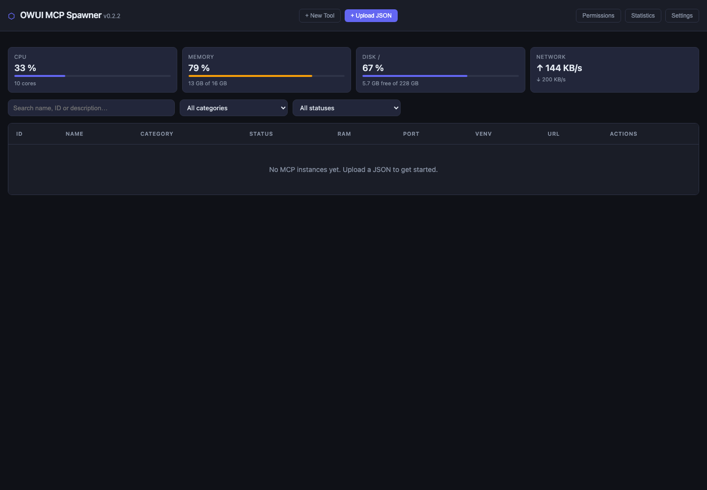
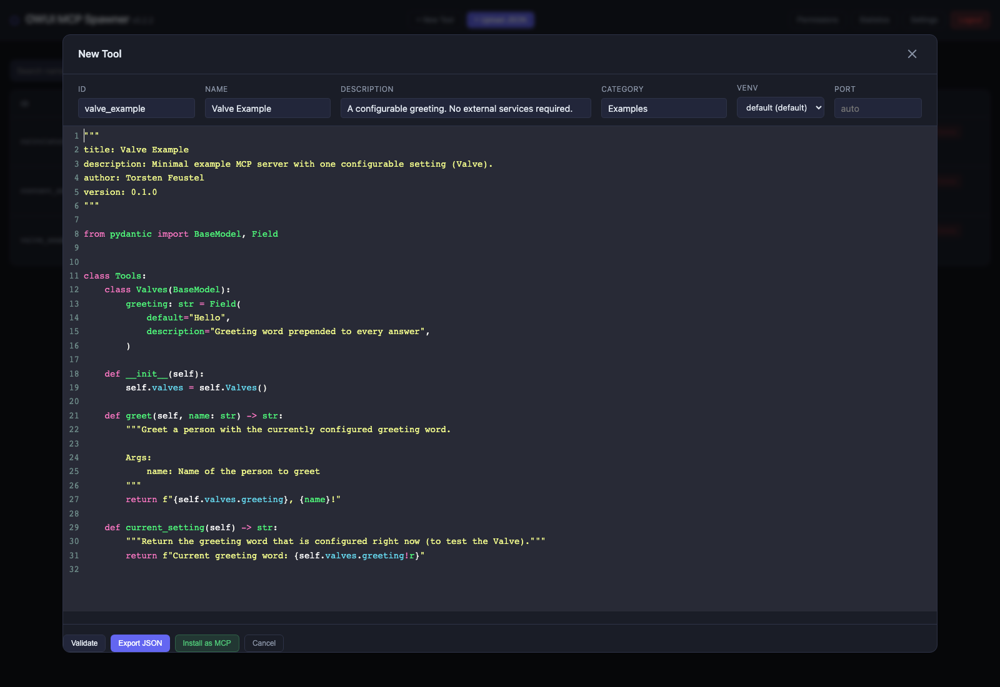
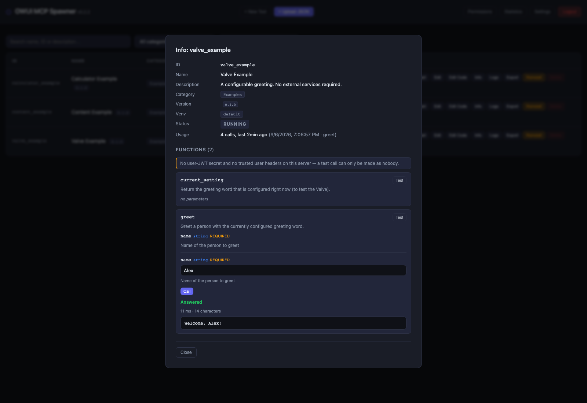
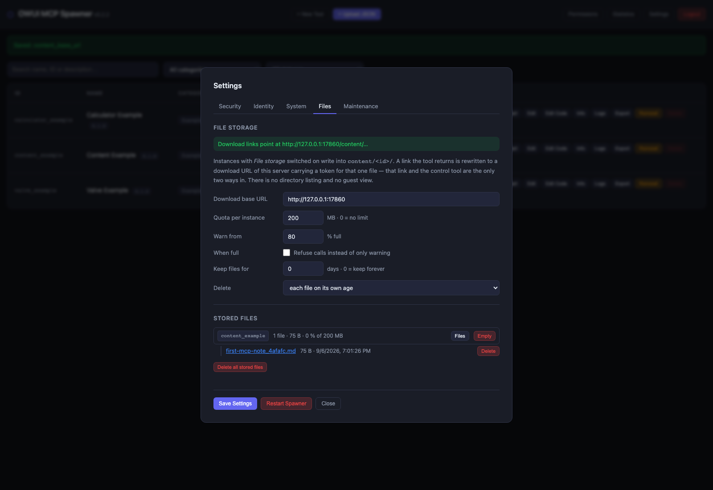

# owui-mcp-spawner

**OWUI MCP Spawner** turns Python tools and OpenWebUI tool exports into standalone [Model Context Protocol](https://modelcontextprotocol.io) servers. A web dashboard handles installation, configuration, start/stop, logs and test calls. Clients connect using MCP over Streamable HTTP.

Two central parts of the framework make it more than a collection of individual MCP servers:

- **[MCP Control Tool](#managing-the-spawner-over-mcp-control-tool):** let an agent manage the framework itself — create tools, configure instances, control processes and inspect logs.
- **[MCP Tool Router](#one-connection-for-all-tools-mcp-tool-router):** give a client one connection for discovering and calling the tools across your running instances, with schemas loaded on demand.

**Quick navigation:** [Installation](#install-and-start-locally) · [First tool](#install-your-first-tool) · [Client connection](#connect-an-mcp-client) · [Security](#network-access-and-authentication) · [Documentation](#operations-and-further-documentation)


*Fresh installation with optional Calculator, Valve and Content examples. These tools need no accounts, API keys or external services. They are not installed automatically.*

## Install and start locally

The commands below use **Python 3.11+** on macOS or Linux, Git and an internet connection for package installation. The package metadata permits Python 3.10; the repository's full test suite requires 3.11+.

```bash
git clone https://github.com/torfeu/owui-mcp-spawner.git
cd owui-mcp-spawner
python3.11 -m venv .venv
.venv/bin/python -m pip install -e .
.venv/bin/python app/manager.py
```

Open **http://127.0.0.1:7860** in a browser. Leave the terminal running; use `Ctrl+C` to stop the manager. If port 7860 is occupied, add `--port 17860` and open that port instead.

The editable install uses the dependency list in `pyproject.toml`, including `psutil` for the system monitor and the required MCP SDK version. Keep the checkout in place because the application also uses its `web/` and `examples/` directories.

A fresh checkout starts with **no instances**. `configs/example.json` is a template and is not loaded as an installed tool. Nextcloud, OpenHAB, OpenWebUI and an LLM are **not required** to install the spawner or try the examples below.



The default bind address is localhost. Without a configured password, local access has full administration rights. See [Network access and authentication](#network-access-and-authentication) before making it reachable from another machine.

## Install your first tool

1. Click **+ New Tool**.
2. Replace the starter code with [examples/example_valve_tool.py](examples/example_valve_tool.py).
3. Set **ID** to `valve_example`, **Name** to `Valve Example` and **Category** to `Examples`.
4. Keep the `default` environment and leave the port empty for automatic allocation.
5. Click **Install as MCP**. The first installation creates the runner environment and installs its base packages; this may take a few minutes.
6. Click **Start** on the new instance.
7. Open **Info**, expand **Test** for `greet`, enter `Alex` and click **Call**. The result should be `Hello, Alex!`.

Each instance runs in a separate process. Its packages live in a named virtual environment: instances share `default` unless you choose another name. Use separate environments for tools with incompatible dependencies. A virtual environment is package isolation, not a security sandbox for untrusted Python.



Change `greeting` under **Edit → Values**, save, then repeat the call. With the default `restart_on_change` setting, a running instance restarts to apply the value. The screenshot below uses `Welcome`.



**Python source goes into + New Tool; OpenWebUI JSON exports go through + Upload JSON.** Installing creates the instance; starting it is a separate action. Only install code you trust: validation and tool calls execute its Python code.

## Examples you can run without external services

| Example source | Suggested ID | Try it |
|---|---|---|
| [Calculator](examples/example_calculator_tool.py) | `calculator_example` | `add(a=7, b=5)` → `12`; `multiply(a=6, b=7)` → `42` |
| [Configurable greeting](examples/example_valve_tool.py) | `valve_example` | `greet(name="Alex")`; change the `greeting` Valve |
| [File creation](examples/example_content_tool.py) | `content_example` | Enable **File storage** in Edit, then call `write_note(title="First MCP note", text="Hello from MCP")` |

Install each Python example through **+ New Tool**. For the calculator screenshot we chose a named environment, `calculator`, to demonstrate package separation; `default` also works for all three examples.

The content example stores files in `content/<instance-id>/`. Under **Settings → Files**, set **Download base URL** to the manager address your client can reach (for a local demo, `http://127.0.0.1:7860`). This makes links usable from a chat client as well as the dashboard. The same tab lists files for download. It is local framework storage; Nextcloud or any other storage integration is optional tool code, not part of the installation.



The shipped [Identity Probe](examples/identity-probe.json) is an optional JSON tool for diagnosing caller identity.

## Connect an MCP client

Copy the running instance's URL from the dashboard. With the default listener setup it has this shape:

```text
http://127.0.0.1:<instance-port>/mcp
```

Add it to your client's MCP server configuration using **Streamable HTTP**. The manager dashboard on port 7860 and an instance's MCP endpoint are different addresses. The port assigned to your instance is shown in the table; screenshot ports are only examples.

Use **Export** for an OpenWebUI connection entry. If the client runs in a container or on another machine, `127.0.0.1` refers to that container or machine: use a reachable spawner address and configure authentication first.

For multiple tools you can optionally enable [instance endpoints](docs/reference.md#shared-mcp-port), [category endpoints](docs/reference.md#one-endpoint-per-category) or install the [tool router](#one-connection-for-all-tools-mcp-tool-router). These are separate choices and are not prerequisites for a fresh installation.

## Managing the spawner over MCP (control tool)

The **MCP Control Tool** lets an agent operate the framework through MCP. It exposes **33 functions**, covering the same everyday workflow as the dashboard: inspect instances, create and edit tools, install dependencies, start processes, diagnose failures and manage generated files.

| Area | Functions and capabilities |
|---|---|
| Instances and processes | List and inspect instances; start, stop, restart and reinstall; read install and runtime logs |
| Tool development | Get a template, validate Python, create or upload a tool, read and save code, export tool JSON |
| Configuration | Change categories, Valve values, lifecycle settings, dependencies and named environments |
| Diagnostics | Read tool schemas, settings, usage and system statistics; list agent identities; check a backup |
| Maintenance | List/read stored files; explicitly enable instance deletion, file deletion or manager restart when needed |

### Set up the control tool

1. Use **+ Upload JSON** with [examples/mcp-manager-control.json](examples/mcp-manager-control.json). Its instance ID is `mcp_manager_control`.
2. Open **Edit → Values**. Set `manager_url` to the manager's address **as reachable from the control instance**, normally `http://127.0.0.1:7860`. Use the actual manager port if you changed it.
3. Set `auth_token` to a manager **agent token** for management tasks, or a **read token** for read-only use. Configure these in **Settings → Security**; see [API tokens](docs/reference.md#api-tokens).
4. Review the `allow_*` Valves and save. **Most actions, including code changes and start/stop, are enabled by default.** Only `allow_delete`, `allow_manager_restart` and `allow_content_delete` default to `false`. Turn off actions the agent should not use.
5. Start the instance and copy its MCP URL from the dashboard into your client. If MCP authentication is enabled, the client also needs the **MCP Bearer token**.

The `auth_token` authorizes the control tool's calls to the manager API; the client's MCP token authorizes access to the control instance. API token permissions and the framework's `--no-edit` / `--no-code-edit` settings still apply in addition to the Valves.

For example, ask your agent to list instances, inspect a failed installation log, or create a calculator tool from the framework template. `create_tool` installs a new instance; `start_instance` starts it as a separate step. A code-editing agent can use `get_tool_code`, `validate_tool_code` and `save_tool_code` to inspect and update an existing tool.

See the [complete control-tool function list and permissions](docs/reference.md#managing-the-spawner-over-mcp-control-tool).

## One connection for all tools (MCP tool router)

The **MCP Tool Router** gives your client one MCP connection across the running tool instances. The model initially sees just **three meta-tools**. It discovers a function, loads that function's parameter schema and then calls it. This reduces the schemas included up front; the actual context savings depend on the installed tools and client.

| Meta-tool | Purpose |
|---|---|
| `find_tools(query_words, category, mode)` | Discover available functions by keyword or category. Without filters, list the allowed running catalog up to `max_results` (default: 60). |
| `describe_tools(tools=["instance.action"])` | Load the complete parameter schemas for the selected function handles. |
| `call_tool(tool="instance.action", arguments={...})` | Invoke a selected function through MCP and return its result. |

### Set up the router

1. Use **+ Upload JSON** with [examples/mcp-tool-router.json](examples/mcp-tool-router.json). Its instance ID is `mcp_tool_router`.
2. In **Edit → Values**, set `manager_url` to the manager's reachable address, normally `http://127.0.0.1:7860`.
3. For a protected manager, set `auth_token` to a manager **read token** so the router can fetch the catalog. If the target MCP endpoints require authentication, set `mcp_token` to their **MCP Bearer token**. These credentials have different purposes.
4. Keep or adjust `deny_instances` (default: `mcp_manager_control`). Optionally restrict discovery and calls using the comma-separated `allow_categories` list.
5. Save and start the router. Add its MCP URL to your client, supplying the MCP Bearer token if required. For the routed tools, use the router connection instead of also registering every instance directly; duplicate connections would still expose their schemas up front.

After installing and starting the calculator example above, the tool-call sequence is:

```python
find_tools(query_words=["calculator"])
describe_tools(tools=["calculator_example.add"])
call_tool(tool="calculator_example.add", arguments={"a": 7, "b": 5})
# Result: 12
```

These are MCP tool calls for the client, not shell commands. Copy handles from `find_tools` and use the schema returned by `describe_tools` for the arguments. Searching discovers functions; searching inside a tool's data requires that tool's own search function.

The router supports both individual instance ports and [shared MCP endpoints](docs/reference.md#shared-mcp-port). It reads endpoint addresses from the manager catalog; `mcp_base_url` is an optional override for a different network setup. With caller identity enabled, it can forward identity to the target, which enforces its own permissions; see [identity forwarding](docs/reference.md#one-connection-for-all-tools-mcp-tool-router).

**The router can invoke tools that write data.** Its manager API access is read-only, but that does not make the routed tool calls read-only. The default exclusion of `mcp_manager_control` is enforced for both discovery and calls. Connect the control tool separately when you want an agent to administer the framework; use the router for access to your application tools.

## Network access and authentication

The **manager password** protects administration; the **MCP Bearer token** protects tool endpoints. Setting one does not automatically configure the other.

For a local setup that will later be accessed over the network:

1. While still bound to localhost, open **Settings → Security**.
2. Set a unique manager password and an MCP Bearer token, then save. Keep the credentials for the dashboard and client respectively.
3. Stop the manager and restart it with the required bind address:

   ```bash
   .venv/bin/python app/manager.py --host 0.0.0.0
   ```

4. Use a reachable host address in the client and supply the MCP token. Use HTTPS through a reverse proxy or a trusted private connection when traffic leaves the local machine.

Settings survive restarts. CLI flags can override saved settings. For unattended startup, `MCP_MANAGER_PASSWORD` or `MCP_MANAGER_PASSWORD_HASH` can provide the manager credential; with `app/manager.py`, configure the MCP token through Settings or `--mcp-token`.

A password-protected manager opens in guest mode when no login is saved, showing a reduced instance list without addresses or administration controls. Use **Login** to authenticate; its dialog also offers **Continue as guest**.


For API read/agent tokens, per-user rules, named agent identities and edit modes, see the [authentication reference](docs/reference.md#authentication). These features are optional; caller identity defaults to `off` for a new instance.

## Operations and further documentation

| Topic | Documentation |
|---|---|
| Dashboard, logs, health checks, statistics and test calls | [Dashboard reference](docs/reference.md#dashboard) |
| Named environments and dependency management | [Virtual environments](docs/reference.md#virtual-environments) |
| Local files, download links, quotas and retention | [File storage](docs/reference.md#file-storage) |
| Backup and restore | [Backup and restore](docs/reference.md#backup-and-restore) |
| Identity and permissions | [Per-user identity](docs/reference.md#per-user-identity-who-is-calling) |
| API routes | [API reference](docs/reference.md#protected-routes-require-bearer-token) |
| Writing tools and JSON import format | [Tool development](docs/reference.md#writing-a-tool) |
| Optional Linux service | [systemd setup](docs/reference.md#systemd-optional), [service template](deploy/owui-mcp-spawner.service.example) |
| Updating an existing installation | [Upgrade guide](docs/upgrading.md) |
| Changes between versions | [Changelog](CHANGELOG.md) |

The working state is in `configs/`, `tools/`, `runtime/` and, for generated files, `content/`. Do not copy these directories from someone else's deployment when you want an empty installation. A framework backup includes configurations and tool code, but runner environments and stored content require separate consideration; see the backup reference.

Configuration and code changes to the same instance are serialized. A second request arriving during an installation or save receives `409`; retry after the first operation finishes. This does not remove any edit functionality.

## Tests and screenshot provenance

Run tests in a disposable checkout, not in an active deployment:

```bash
.venv/bin/python -m unittest discover -s tests -v
```

See [tests/README.md](tests/README.md) for coverage, isolation requirements and integration-test prerequisites. Some tests require local ports and a prepared runner environment. The fresh-installation run did not finish fully green; the report below records which sweeps errored and why.

The screenshots above were captured from a separate installation with newly created manager and runner environments. Only the example tools shown were added; no production configuration, credentials or private service integrations were copied. See the [fresh-installation test report](docs/fresh-installation.md) for the exact checks and results.

## Credits and license

The web editor uses [CodeMirror](https://codemirror.net), licensed under MIT. OWUI MCP Spawner is distributed under the [MIT license](LICENSE).
